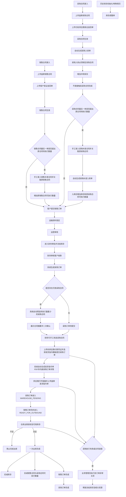

# 隽港顺达供应链项目 V5 后台合同与双订单升级改造方案

## 1. 文档信息
- 版本：V5
- 日期：2026-03-02
- 状态：开发前定稿
- 适用范围：后台管理中心为主，小程序按新业务重构

## 2. 本次规划结论
- 现有系统应从“单一订单流转系统”升级为“销售订单 + 采购订单 + 合同管理 + 采购入库 + 分域报表中心”的后台经营系统。
- 当前 `orders` 不建议继续扩展为一张同时承担客户销售、采购履约、供应商协同、仓库执行的超级订单表。
- 当前单一订单业务建议重构为两条链路：
  - 销售订单：客户侧、收款侧、销售合同侧。
  - 采购订单：供应商侧、付款侧、仓库执行侧、采购合同侧。
- 财务确认客户收款后，销售订单不应“变形”为同一条采购订单记录，而应自动生成一条关联采购订单，销售订单继续保留并展示履约进度。
- 销售合同、采购合同允许被多张订单重复引用；最后一张订单允许超过合同当前待执行数量。
- 本期不生成“补差子订单”；合同超出原合同数量时，改为手工录入补差合同。
- 销售补差合同必须关联原销售合同，仅用于增加原销售合同可执行数量，不改绑历史销售订单。
- 采购补差合同必须关联原采购合同，不改绑历史采购订单；采购补差合同生效后自动生成采购补差入库单，入库后增加库存和原采购合同可执行数量。
- 销售订单生成采购订单时，系统默认自动选择同油品下未执行完数量最少的采购合同；若并列则按生效日期最早、合同号最小优先；系统必须展示合同关键信息并进行二次确认，仍允许后台手工改选采购合同。
- 若无可用采购合同，则仍自动生成采购订单，但初始状态为“待提交”，后续可人工补录采购合同并继续提交。
- 采购订单数量不允许手工修改，直接沿用销售订单数量。
- 销售订单经运营审核通过、流转到财务审批节点时即冻结库存；业务管理员执行订单终止类动作时，如已冻结库存则释放冻结库存及相关执行资源。
- 销售合同生效前必须上传盖章销售合同与客户保证金银行回单。
- 采购合同生效前必须上传盖章采购合同与付给供应商保证金的银行回单。
- 合同仅允许财务、运营、业务管理员创建和维护，一期不开发合同审批流；合同生效后不允许修改，关联合同订单、采购入库、仓库出库等任何业务单据后不得作废，不支持手工关闭。
- 采购订单下游流转前，必须上传向供应商付款的付款凭证。
- 采购订单提交时必须人工选择发货指令单模板；系统按所选模板自动生成发货指令单 PDF，并内嵌在采购订单详情中供供应商打开查看。
- 发货指令单模板必须支持多模板配置，不再沿用单模板配置模式。
- 采购订单进入 `WAREHOUSE_PENDING` 时，销售订单同步进入 `READY_FOR_OUTBOUND`。
- 财务收款后如采购执行失败或采购合同确认错误并已继续流转，则由业务管理员将销售订单与采购订单直接异常关闭；系统不支持原单重开，需重新下单。
- 销售订单完成标志为一次实际出库数量等于订单数量；采购订单完成标志为对应销售订单完成。
- 销售合同、采购合同的执行数量与库存扣减统一以实际出库数量为准。
- 一张销售订单仅允许一次出库，不允许部分出库或多次出库；一期不新增计量误差容差处理。
- 冻结库存不计入可用库存；仓库出库前必须校验可用库存，不足则禁止完成出库。
- 运输资料仅允许客户维护，提交销售订单即锁定；运营、财务、供应商、仓库仅可查看快照；一期不做实名与车辆合规校验。
- 保留历史运输信息一键带入能力，优先降低客户重复录入和误操作风险。
- V5 中运营、财务、供应商、仓库仅保留正向通过、提交、确认、出库完成等动作；订单终止类动作统一收口到业务管理员。
- 一张销售订单仅对应一张采购订单，一期不预留拆分为多张采购订单的业务接口。
- 客户收款凭证、保证金回单、向供应商付款凭证一期仅校验上传与存在，不做系统内金额匹配或合规校验。
- 采购合同生效后自动生成采购入库单；采购入库必须绑定采购合同，且不由采购订单触发；历史库存初始化与特殊情况必须走独立库存调整单。
- 本次范围按单阶段一次性开发、联调、验收和上线，不再分阶段独立交付。

## 3. 设计原则
### 3.1 业务原则
- 销售与采购必须分离：客户收款与供应商付款是两套不同的业务链，不能再共用同一组状态字段。
- 合同与订单必须强关联：销售订单必须绑定销售合同，采购订单必须绑定采购合同。
- 合同允许多订单履约：一份合同可以对应多张订单，最后一张订单允许超执行。
- 合同生效要有前置条件：仅签模板、生成 PDF 不等于合同生效，必须以盖章合同与保证金回单作为前提。
- 合同创建权限要收口：仅财务、运营、业务管理员可创建和维护合同，一期不做合同审批流。
- 金额必须快照化：合同被选中后，订单保留合同价格快照，后续合同改价不能影响已生成订单。
- 数值口径要统一：金额保留 2 位小数、吨位保留 4 位小数，统一使用四舍五入。
- 报表口径要可解释：合同待执行数量允许为负值口径的内部推导结果，但展示层应统一输出“待执行数量”和“超执行数量”。
- 仓库执行要一次完成：销售订单不允许部分出库，避免合同执行与库存扣减口径分裂。
- 库存与合同执行要分层：采购合同、采购入库、采购订单履约、仓库出库是不同事件，不能混成一个动作；采购入库由采购合同驱动，采购订单不驱动采购入库。
- 异常链路要直接闭环：财务收款后如采购执行失败或合同确认错误，由业务管理员将销售订单与采购订单直接异常关闭并释放资源，不在系统内做原单重开。
- 运输资料要锁定责任：运输资料仅客户可维护，提交销售订单即锁定，其他角色只读查看。
- 操作要尽量减误：保留历史运输信息一键带入能力，减少客户重复录入和误填。
- 订单终止权要收口：V5 中仅业务管理员可执行订单终止类动作，其他角色不再保留终止类动作；销售订单仅在客户收款确认前允许驳回，客户收款确认后及全部采购订单仅允许异常关闭。

### 3.2 技术原则
- 未来业务由新建销售订单、采购订单、合同与库存台账体系接管，不再继续扩展现有 `orders`。
- V5 作为全新系统一次性上线，不做 V4 历史订单、合同、库存、报表数据迁移；上线后只承接 V5 新录入业务和初始化库存调整数据。
- 后台可复用公共能力：账号认证、权限校验、附件上传、审计日志、后台框架、PDF 生成基础设施。
- 后台应重构核心业务域：订单域、合同域、库存流水域、报表域。
- 小程序建议按新业务整体重构，而不是在当前页面上继续叠加兼容逻辑。
- 所有合同文档生成时必须保存模板快照和字段快照，保证历史文档不可变。
- 新接口按业务域设计，便于后续小程序接入，而不是按后台页面写死。
- 销售订单与采购订单按一一对应建模，避免为不存在的一拆多场景预留接口复杂度。

## 4. 核心业务重构
## 4.1 当前订单如何拆分
### 建议方案
- 新增 `sales_orders` 作为销售订单主表。
- 新增 `purchase_orders` 作为采购订单主表。
- 采购订单通过唯一外键关联销售订单，形成一一对应关系。
- 一张销售订单固定生成一张采购订单，一期不预留拆分为多张采购订单的接口。
- 销售合同和采购合同均允许被多张订单重复引用。

### 为什么不建议继续复用单一订单
- 当前订单已经承担：
  - 客户下单
  - 运营审核
  - 财务收款确认
  - 供应商审核
  - 仓库出库
- 本次升级后还要承担：
  - 销售合同金额口径
  - 采购合同金额口径
  - 合同生效附件
  - 保证金回单
  - 向供应商付款的付款凭证
  - 合同执行报表
- 如果继续在一张订单上叠状态，字段语义会持续混乱，后台管理、审计追溯、报表解释都会越来越难维护。

### 推荐拆分后的链路
1. 客户在小程序提交销售订单，并强制选择销售合同。
2. 运营审核销售订单，销售订单经运营审核通过、流转到财务审批节点时即冻结库存。
3. 财务审核客户收款。
4. 财务审核通过后，系统自动生成关联采购订单。
5. 若存在同油品、未作废、未完成的采购合同，则系统默认按“待执行数量最少 -> 生效日期最早 -> 合同号最小”的规则预选采购合同；系统展示合同号、供应商、合同待执行数量、预计超执行数量等关键信息并要求二次确认，后台仍允许手工改选采购合同。
6. 若不存在可用采购合同，则采购订单先以“待提交”状态生成，等待后续人工补录采购合同并提交。
7. 采购订单数量固定等于销售订单数量，不允许手工修改。
8. 财务上传向供应商付款的付款凭证，并在提交采购订单时人工选择发货指令单模板；系统自动生成发货指令单 PDF 并内嵌在采购订单详情中。
9. 供应商在采购订单详情打开系统生成的发货指令单 PDF，上传盖章发货指令单并确认通过。
10. 供应商确认通过后，采购订单进入 `WAREHOUSE_PENDING`，销售订单同步进入 `READY_FOR_OUTBOUND`。
11. 仓库上传出库单并按实际出库数量完成出库。
12. 一张销售订单仅允许一次出库，不允许部分出库或多次出库；一期不新增计量误差容差处理。
13. 实际出库时，同步更新销售订单、采购订单、库存、销售合同、采购合同的执行数量。
14. 当销售订单一次实际出库数量等于订单数量时，销售订单完成。
15. 对应销售订单完成时，关联采购订单同步完成。
16. 若采购执行失败、采购合同确认错误且已继续流转，则由业务管理员将销售订单与采购订单直接异常关闭并释放冻结库存及相关执行资源，由业务重新下单。
17. 销售合同、采购合同在实际出库后分别累计 `executed_qty`，当待执行数量小于等于 `0` 时自动完成。
18. 若最后一笔销售订单超过原销售合同待执行数量，则后台手工录入销售补差合同并关联原销售合同，增加原销售合同可执行数量，不改绑原销售订单。
19. 若最后一笔采购订单超过原采购合同待执行数量，则后台手工录入采购补差合同并关联原采购合同；采购补差合同生效后自动生成采购补差入库单，入库后增加库存和原采购合同可执行数量，不改绑原采购订单。
20. 补差合同只关联原合同，不生成补差子订单。

### 结论
- 销售订单不在财务审核后消失，而是进入“待出库/采购执行中”状态。
- 采购订单承担后续执行动作。
- 客户只看销售订单，不直接看到采购订单。
- 供应商与仓库只看采购订单，不直接操作销售订单。

## 4.1.1 整体业务流程图

## 4.2 双订单模型
### 销售订单
- 面向对象：客户、运营、财务、管理层。
- 核心作用：
  - 承接客户需求
  - 绑定销售合同
  - 记录客户收款
  - 对外展示履约进度
  - 记录累计实际出库数量
- 金额口径：
  - 销售单价、销售金额来自销售合同快照
  - 财务节点不再手工录入订单金额

### 采购订单
- 面向对象：财务、供应商、仓库、管理层。
- 核心作用：
  - 承接供应链执行
  - 绑定采购合同
  - 记录向供应商付款
  - 驱动盖章指令单与仓库出库
  - 跟踪与销售订单一致的履约数量
- 金额口径：
  - 采购单价、采购金额来自采购合同快照
  - 财务节点必须上传向供应商付款的付款凭证后才能向供应商流转

## 4.3 合同与订单的关系
### 销售合同 -> 销售订单
- 销售订单必须关联销售合同。
- 一份销售合同可对应多张销售订单。
- 关联时只允许选择：
  - 状态为 `EFFECTIVE` 或 `PARTIALLY_EXECUTED`
  - 未完成、未作废
  - 客户公司匹配
- 推荐校验：
  - 销售订单油品必须等于销售合同项目名称
- 新口径建议：
  - 即使销售订单数量大于销售合同当前待执行数量，也允许创建和流转。
  - 销售合同执行数量按实际出库数量扣减，而不是按订单创建数量扣减。
  - 若最后一笔销售订单超出原销售合同待执行数量，则手工录入销售补差合同并关联原销售合同。
  - 销售补差合同不生成补差订单，不改绑历史销售订单，仅用于增加原销售合同可执行数量。
  - 合同待执行数量小于等于 `0` 时自动完成。

### 采购合同 -> 采购订单
- 销售订单转采购订单时，必须选择采购合同。
- 一份采购合同可对应多张采购订单。
- 关联时只允许选择：
  - 状态为 `EFFECTIVE` 或 `PARTIALLY_EXECUTED`
  - 未完成、未作废
  - 油品与销售订单一致
- 推荐校验：
  - 采购合同供应商必须为有效供应商
- 新口径建议：
  - 系统默认自动选择同油品下待执行数量最少、且仍未完成的采购合同；若并列则按生效日期最早、合同号最小优先。
  - 自动选择时必须展示合同号、供应商、待执行数量、预计超执行数量等关键信息，并进行二次确认。
  - 后台允许在生成采购订单时手工改选采购合同。
  - 即使采购订单数量大于采购合同当前待执行数量，也允许创建和流转。
  - 采购订单数量固定沿用销售订单数量，不允许手工修改。
- 采购合同执行数量按实际出库数量扣减，而不是按订单创建数量扣减。
  - 若最后一笔采购订单超出原采购合同待执行数量，则手工录入采购补差合同并关联原采购合同。
  - 采购补差合同不改绑历史采购订单；采购补差合同生效后自动生成采购补差入库单，入库后增加库存和原采购合同可执行数量。
  - 合同待执行数量小于等于 `0` 时自动完成。
  - 采购合同确认后如发现选错且订单已继续流转，则由业务管理员将销售订单与采购订单直接异常关闭，释放资源后重新下单。

### 不再沿用的旧限制
- 不再沿用“合同待执行数量不足就禁止绑定”的旧限制。
- 一期不生成补差子订单。
- 一期以手工补差合同替代补差子订单。
- 一期不强制做合同硬冻结或硬占用控制。
- 合同执行差异主要通过执行情况报表展示，而不是通过拆分子订单解决。

## 4.4 合同数量口径建议
### 销售合同
- `base_contract_qty`：原销售合同数量
- `supplement_qty_total`：销售补差合同累计生效数量
- `effective_contract_qty`：销售合同当前可执行总量
- `executed_qty`：已完成销售订单对应的实际出库数量
- `raw_pending_execution_qty`：原始待执行数量
- `pending_execution_qty`：展示用待执行数量
- `over_executed_qty`：超执行数量

公式建议：
- `effective_contract_qty = base_contract_qty + supplement_qty_total`
- `raw_pending_execution_qty = effective_contract_qty - executed_qty`
- `pending_execution_qty = max(raw_pending_execution_qty, 0)`
- `over_executed_qty = max(-raw_pending_execution_qty, 0)`
- 当 `raw_pending_execution_qty <= 0` 时，合同视为完成。
- 原销售合同数量与补差合同数量分开留痕，不直接改写原合同数量。

### 采购合同
- `base_contract_qty`：原采购合同数量
- `supplement_qty_total`：采购补差合同累计生效数量
- `effective_contract_qty`：采购合同当前可执行总量
- `stocked_in_qty`：累计采购入库数量
- `executed_qty`：已完成采购订单对应的实际出库数量
- `raw_pending_execution_qty`：原始待执行数量
- `pending_execution_qty`：展示用待执行数量
- `over_executed_qty`：超执行数量
- `pending_stock_in_qty`：待入库数量

公式建议：
- `effective_contract_qty = base_contract_qty + supplement_qty_total`
- `raw_pending_execution_qty = effective_contract_qty - executed_qty`
- `pending_execution_qty = max(raw_pending_execution_qty, 0)`
- `over_executed_qty = max(-raw_pending_execution_qty, 0)`
- `pending_stock_in_qty = effective_contract_qty - stocked_in_qty`
- 当 `raw_pending_execution_qty <= 0` 时，合同视为完成。
- 原采购合同数量与补差合同数量分开留痕，不直接改写原合同数量。

### 一期控制取舍
- 按当前确认的业务口径，一期不做合同“硬冻结/硬占用”。
- 合同是否超执行，以实际出库后的 `executed_qty` 为准。
- 为了不让报表失真过于难解释，建议保留 `over_executed_qty` 展示字段。

### 一期风险控制机制
- 合同不做硬冻结，但自动选合同时必须展示“待执行数量、预计执行后待执行数量、预计超执行数量”并进行二次确认。
- 库存维度采用冻结控制：
  - `on_hand_qty`：账面库存
  - `reserved_qty`：冻结库存
  - `available_qty = on_hand_qty - reserved_qty`
- 销售订单经运营审核通过、流转到财务审批节点时即冻结库存。
- 冻结库存不属于可用库存，不能被其他订单重复使用。
- 业务管理员执行订单终止类动作时，如已冻结库存则释放冻结库存。
- 仓库实际出库前必须再次做库存强校验，避免库存超卖。

## 4.5 合同保证金与生效规则
### 通用建议
- 销售合同、采购合同都增加保证金字段。
- 建议同时保存：
  - `deposit_rate`：保证金比例，默认 `10%`，可手工调整
  - `deposit_amount`：保证金金额，按合同含税金额自动计算并固化
- 这样既符合“默认 10%”的业务习惯，也能直接对应银行回单金额。
- 保证金实际业务口径按含税金额计算。
- 客户收款凭证、保证金回单、向供应商付款凭证一期仅校验已上传，不做系统内金额匹配或合规校验。

### 销售合同生效规则
- 销售合同在 `DRAFT` 或 `PENDING_EFFECTIVE` 状态下可编辑。
- 销售合同生效前必须具备：
  - 已上传盖章销售合同
  - 已上传客户保证金银行回单
- 满足前提后，合同方可进入 `EFFECTIVE`。
- 销售合同生效后不允许修改。
- 销售合同关联合同订单、采购入库、仓库出库等业务单据后不得作废。

### 采购合同生效规则
- 采购合同在 `DRAFT` 或 `PENDING_EFFECTIVE` 状态下可编辑。
- 采购合同生效前必须具备：
  - 已上传盖章采购合同
  - 已上传付给供应商保证金的银行回单
- 满足前提后，合同方可进入 `EFFECTIVE`。
- 采购合同生效后不允许修改。
- 采购合同关联合同订单、采购入库、仓库出库等业务单据后不得作废。

## 4.6 重构范围建议
### 后台建议复用
- 登录鉴权与角色权限框架
- 用户管理与组织公司基础能力
- 附件上传、文件下载、OSS 存储能力
- 操作日志、订单日志、业务日志基础设施
- 后台管理台整体壳层与基础组件
- PDF 生成基础能力

### 后台建议重构
- 订单数据模型
- 合同数据模型
- 合同生效流转
- 采购入库与库存流水
- 报表中心口径
- 后台业务详情页与操作流

### 合同创建角色建议
- 合同创建、编辑、生效操作暂由财务、运营、业务管理员执行。
- 一期不开发独立审批流，但必须记录创建人、修改人、生效人、作废人及时间。
- 一期允许同一用户完成创建、编辑和提交生效。
- 合同不支持手工关闭，特殊情况线下处理。

### 小程序建议
- 小程序建议按新业务整体重构。
- 当前小程序页面结构建立在旧单一订单流转之上，继续兼容改造的成本和认知复杂度都偏高。
- 新小程序建议围绕以下对象重组：
  - 销售订单
  - 合同选择
  - 收款进度
  - 采购执行进度
  - 订单报表查询

## 4.7 运输资料快照规则
- 运输资料仅允许客户在提交销售订单前维护。
- 保留历史运输信息一键带入能力，允许客户基于历史资料快速填充后再确认提交。
- 销售订单提交后，运输资料按订单快照锁定，不允许客户、运营、财务、供应商、仓库再修改。
- 运营、财务、供应商、仓库仅可查看运输资料快照，用于履约协同。
- 一期不实现司机实名、身份证、车牌等系统内合规校验，相关合规责任在线下业务执行环节承担。

## 5. 协议模板中心方案
## 5.1 菜单结构
- 协议模板
  - 发货指令单模板
  - 采购合同模板
  - 销售合同模板

## 5.2 模板对象设计
- 模板必须支持按类型独立维护，不再使用“单模板系统配置”模式。
- 每类模板至少包含：
  - 模板名称
  - 模板编码
  - 模板类型
  - 是否默认
  - 启用/停用
  - 固定条款内容
  - 占位符定义
  - PDF 样式配置
- 发货指令单模板需支持在采购订单提交时人工选择，不强制只能使用默认模板。
- 当前不提供模板版本管理，模板修改直接覆盖当前正文。

## 5.3 模板快照规则
- 合同生成时保存：
  - `template_id`
  - `template_snapshot_json`
  - `variable_snapshot_json`
- 历史合同不受模板后续修改影响。

## 5.4 文档渲染建议
- 发货指令单：继续沿用轻量模板能力。
- 采购合同、销售合同：改为“结构化 HTML 模板 -> PDF”。
- 原因：
  - 合同条款更长
  - 需要表格、分页、签章区
  - 更适合结构化正文和快照渲染

## 6. 采购管理方案
## 6.1 菜单结构
- 采购管理
  - 采购合同
  - 采购入库
  - 采购订单

## 6.2 采购合同
### 录入方式
- 选择采购合同模板
- 自动生成采购合同号
- 自动带入合同日期
- 手工填写或选择：
  - 供应商名称
  - 项目名称（产品名称）
  - 数量
  - 单位（默认吨）
  - 含税单价
  - 税率（默认 13%）
  - 保证金比例（默认 10%）
  - 交货期限（天）

### 自动计算字段
- 含税金额 = 数量 × 含税单价
- 不含税金额 = 含税金额 ÷ (1 + 税率)
- 税额 = 含税金额 - 不含税金额
- 保证金金额 = 含税金额 × 保证金比例
- 合计金额大写 = 根据含税金额自动生成

### 生效附件
- 盖章采购合同
- 付给供应商保证金的银行回单

### 页面动作
- 保存草稿
- 生成 PDF
- 下载 PDF
- 提交生效
- 作废（仅未关联合同订单、采购入库、仓库出库等业务单据时可用）

### 状态建议
- `DRAFT`
- `PENDING_EFFECTIVE`
- `EFFECTIVE`
- `PARTIALLY_EXECUTED`
- `COMPLETED`
- `VOIDED`

## 6.3 采购入库
### 业务定位
- 采购合同与采购入库必须拆开，但采购入库由采购合同生效自动生成。
- 合同签署不等于实物入库，入库确认后才增加库存。
- 采购入库代表中转库存补货，不作为采购合同完成标志。
- 采购入库必须绑定采购合同，不允许无合同入库。
- 采购订单不产生采购入库，采购订单仅承担付款、供应商审核、仓库出库链路。

### 页面字段
- 选择采购合同
- 展示合同摘要：
  - 采购合同号
  - 供应商名称
  - 合同日期
  - 产品名称
  - 合同数量
  - 已入库数量
  - 待入库数量
- 合同外信息：
  - 采购入库仓
  - 油品
  - 入库数量
  - 入库日期
  - 入库备注

### 校验规则
- 油品必须与合同项目名称一致。
- 入库数量不能超过采购合同剩余待入库数量。
- 仓库必须为有效仓库。

### 入库后动作
- 增加该仓库该油品 `available_qty_ton`
- 写入库存流水台账
- 更新采购合同 `stocked_in_qty`

### 生成规则
- 采购合同生效后，系统自动生成一张对应的采购入库单。
- 采购入库单允许后续人工补充入库数量、入库日期、备注等信息。
- 若合同后续需要多次补货，可基于同一采购合同继续新增采购入库记录。

## 6.3.1 库存调整单
### 业务定位
- 用于历史库存初始化和特殊场景库存修正。
- 不替代采购入库，不替代仓库出库。

### 适用场景
- 系统首次上线时录入历史库存
- 盘点差异修正
- 特殊业务补录

### 必要规则
- 必须填写调整原因。
- 必须记录调整前数量、调整数量、调整后数量。
- 必须写入库存流水台账和审计日志。

## 6.4 采购订单
### 来源
- 由销售订单财务审核通过后自动生成。

### 关键字段
- 自动生成采购订单号
- 关联销售订单号
- 关联采购合同号
- 采购合同快照
- 发货指令单模板
- 系统生成发货指令单 PDF 链接
- 油品、数量、单位
- 累计实际出库数量
- 采购单价、采购金额、税额快照
- 向供应商付款的付款凭证
- 盖章发货指令单
- 出库单

### 状态建议
- `PENDING_SUBMIT`
- `SUPPLIER_PAYMENT_PENDING`
- `SUPPLIER_REVIEW_PENDING`
- `WAREHOUSE_PENDING`
- `COMPLETED`
- `REJECTED`（仅允许业务管理员在客户收款确认前置入）
- `ABNORMAL_CLOSED`（仅允许业务管理员在客户收款确认后置入）

### 必要规则
- 财务必须上传向供应商付款的付款凭证后，采购订单才能流转到供应商审核。
- 财务提交采购订单时必须人工选择发货指令单模板，系统自动生成发货指令单 PDF 并写入采购订单详情。
- 供应商通过采购订单详情打开系统生成的发货指令单 PDF，上传盖章发货指令单后，采购订单进入 `WAREHOUSE_PENDING`。
- 采购订单进入 `WAREHOUSE_PENDING` 后，销售订单同步进入 `READY_FOR_OUTBOUND`，仓库才可出货。
- 采购订单数量固定等于销售订单数量，不允许财务或采购侧手工修改采购数量。
- 即使采购订单数量大于采购合同当前待执行数量，也允许继续执行。
- 若无可用采购合同，则采购订单先以 `PENDING_SUBMIT` 状态生成，后续人工补录采购合同并提交。
- 自动选合同时必须展示合同号、供应商、待执行数量、预计超执行数量等关键信息，并进行二次确认。
- 采购订单流转后如发现采购合同选错，不支持原单改绑，直接将销售订单与采购订单异常关闭并重新下单。
- 运营、财务、供应商、仓库不再具备订单驳回或异常关闭权限；仅业务管理员可执行订单终止类动作。
- 采购订单完成标志为对应销售订单完成。
- 采购合同执行数量按实际出库数量扣减。

## 7. 销售管理方案
## 7.1 菜单结构
- 销售管理
  - 销售合同
  - 销售订单

## 7.2 销售合同
### 录入方式
- 选择销售合同模板
- 自动生成销售合同号
- 自动带入合同日期
- 手工填写或选择：
  - 客户名称
  - 项目名称（产品名称）
  - 数量
  - 单位（默认吨）
  - 含税单价
  - 税率（默认 13%）
  - 保证金比例（默认 10%）
  - 交货日期

### 自动计算字段
- 含税金额 = 数量 × 含税单价
- 不含税金额 = 含税金额 ÷ (1 + 税率)
- 税额 = 含税金额 - 不含税金额
- 保证金金额 = 含税金额 × 保证金比例
- 合计金额大写 = 根据含税金额自动生成

### 生效附件
- 盖章销售合同
- 客户保证金银行回单

### 页面动作
- 保存草稿
- 生成 PDF
- 下载 PDF
- 提交生效
- 作废（仅未关联合同订单、采购入库、仓库出库等业务单据时可用）

### 状态建议
- `DRAFT`
- `PENDING_EFFECTIVE`
- `EFFECTIVE`
- `PARTIALLY_EXECUTED`
- `COMPLETED`
- `VOIDED`

## 7.3 销售订单
### 来源
- 客户在小程序提交销售订单。

### 必选关联
- 必须绑定销售合同。
- 即使销售订单数量大于销售合同当前待执行数量，也允许继续创建和流转。

### 金额规则
- 销售订单金额不再来源于运营填写。
- 销售订单金额由销售合同单价和订单数量自动计算并固化快照。
- 销售订单需保存累计实际出库数量。
- 运输资料仅允许客户维护，提交销售订单后即锁定为订单快照。

### 状态建议
- `SUBMITTED`
- `OPERATOR_APPROVED`
- `CUSTOMER_PAYMENT_CONFIRMED`
- `READY_FOR_OUTBOUND`
- `COMPLETED`
- `REJECTED`（仅业务管理员可置入）
- `ABNORMAL_CLOSED`（仅业务管理员可置入）

### 完成规则
- 销售订单经运营审核通过、流转到财务审批节点时即冻结库存。
- 采购订单进入 `WAREHOUSE_PENDING` 时，销售订单同步进入 `READY_FOR_OUTBOUND`。
- 一张销售订单仅允许一次出库。
- 一次实际出库数量等于销售订单数量时，销售订单完成。
- 实际出库时同步扣减销售合同 `executed_qty`。
- 若财务收款后采购执行失败，则由业务管理员将销售订单与采购订单直接异常关闭并释放资源。

## 8. 双订单联动规则
## 8.1 自动生成采购订单
- 销售订单完成财务收款审核后，系统自动生成采购订单草稿。
- 系统默认自动选择同油品下未执行完数量最少的采购合同，并允许后台手工改选。
- 自动选择时必须展示合同号、供应商、待执行数量、预计执行后待执行数量、预计超执行数量，并进行二次确认。
- 若暂无可用采购合同，则采购订单保留空合同并停留在 `PENDING_SUBMIT`。
- 采购订单默认带出：
  - 销售订单号
  - 销售合同号
  - 采购合同号
  - 发货指令单模板
  - 产品名称
  - 数量
  - 单位
  - 目标仓库
  - 运输资料快照
- 采购订单数量固定等于销售订单数量，不允许后台手工修改。
- 销售订单与采购订单固定一一对应，不预留一张销售订单拆分多张采购订单的接口。

## 8.2 客户展示口径
- 客户仅看到销售订单。
- 客户侧进度节点可展示为：
  - 提交订单
  - 运营审核
  - 收款确认
  - 采购执行中
  - 供应商放货
  - 仓库出货
  - 完成

## 8.3 内部展示口径
- 内部可查看销售订单与采购订单的关联关系。
- 后台建议在销售订单详情增加“关联采购订单摘要”。
- 后台建议在采购订单详情增加“来源销售订单摘要”。
- 后台建议在合同详情增加“关联订单列表”，直接展示合同已关联的全部订单、累计执行量、剩余待执行量和超执行量。
- 后台建议在合同选择弹窗中展示“当前待执行数量、预计执行后待执行数量、预计超执行数量”。
- 后台建议在采购订单详情增加“待提交/待付款/待供应商/待仓库”的清晰阶段提示。
- 后台建议在采购订单详情明确展示“已二次确认的采购合同摘要”，便于后续追责与审计。
- 后台建议在采购订单详情内嵌展示“发货指令单 PDF 链接”，供供应商直接打开查看。

## 9. 金额与税务口径
## 9.1 合同金额口径
- 所有合同金额字段建议自动计算，只读展示，不允许手填。
- 可编辑字段建议仅保留：
  - 数量
  - 含税单价
  - 税率
  - 保证金比例
- 金额统一保留 2 位小数。
- 吨位统一保留 4 位小数。
- 数值统一使用四舍五入。

## 9.2 订单金额口径
- 销售订单金额来自销售合同快照。
- 采购订单金额来自采购合同快照。
- 财务审核不再负责订单定价，仅负责凭证审核。

## 9.3 税率建议
- 默认税率 13%
- 允许后台维护默认税率
- 允许合同级覆盖默认税率

## 10. 报表中心方案
## 10.1 一级菜单
- 报表中心

## 10.2 报表清单
### 销售订单报表
- 销售订单号
- 销售合同号
- 客户名称
- 产品
- 订单数量
- 实际出库数量
- 销售单价
- 销售金额
- 状态
- 关联采购订单号

### 采购订单报表
- 采购订单号
- 关联销售订单号
- 采购合同号
- 供应商名称
- 产品
- 订单数量
- 实际出库数量
- 采购单价
- 采购金额
- 状态
- 向供应商付款的付款凭证状态

### 销售合同报表
- 销售合同号
- 客户名称
- 产品
- 原合同数量
- 补差数量
- 合同总量
- 保证金比例
- 保证金金额
- 合同状态
- 生效日期
- 盖章合同附件状态
- 保证金回单状态
- 已执行数量
- 待执行数量
- 超执行数量

### 采购合同报表
- 采购合同号
- 供应商名称
- 产品
- 原合同数量
- 补差数量
- 合同总量
- 保证金比例
- 保证金金额
- 合同状态
- 生效日期
- 盖章合同附件状态
- 保证金回单状态
- 已入库数量
- 已执行数量
- 待执行数量
- 超执行数量

### 库存变动报表
- 日期时间
- 仓库
- 油品
- 变动类型
- 业务来源
- 业务单号
- 变动前数量
- 变动数量
- 变动后数量
- 操作人

### 仓库出入库台账
- 日期时间
- 仓库
- 油品
- 业务类型
- 数量
- 关联采购订单号
- 关联采购合同号
- 调整原因/备注

## 10.3 报表实现前提
- 必须新增库存流水台账。
- 必须新增合同执行累计字段。
- 旧版单一订单报表建议在 V5 上线后降级为历史过渡报表，不再作为核心经营报表。
- 新版报表以销售订单、采购订单、销售合同、采购合同四个业务域分别建模。
- 合同报表合并主数据与执行字段，降低低频业务下的报表维护复杂度。
- 客户仅开放销售订单报表、销售合同报表。
- 供应商仅开放采购订单报表、采购合同报表。
- 仓库仅开放仓库出入库台账。
- 运营、财务、业务管理员、超级管理员开放全部后台报表。
- 各报表必须按角色裁剪字段：客户不返回采购侧字段；供应商不返回客户侧字段；仓库台账不返回金额字段。

## 11. 建议新增的数据对象
## 11.1 模板类
- `agreement_templates`
- `agreement_template_versions`
  - 仅保留为内部兼容存储，业务上不开放版本管理

## 11.2 合同类
- `purchase_contracts`
- `purchase_contract_items`
- `sales_contracts`
- `sales_contract_items`
- 合同主表建议增加：
  - `contract_kind`：`PRIMARY` / `SUPPLEMENT`
  - `source_contract_id`：补差合同指向原合同
  - `base_contract_qty`
  - `supplement_qty_total`
  - `effective_contract_qty`

## 11.3 订单类
- `sales_orders`
- `purchase_orders`
- `purchase_orders.sales_order_id` 唯一关联

## 11.4 履约类
- `purchase_stock_ins`
- `inventory_adjustments`
- `contract_execution_logs`
- `contract_execution_snapshots`
- `inventory_movements`
- `supplier_payment_vouchers`

## 11.5 附件类
- 合同 PDF
- 发货指令单 PDF
- 盖章销售合同
- 盖章采购合同
- 客户保证金银行回单
- 付给供应商保证金的银行回单
- 向供应商付款的付款凭证
- 盖章发货指令单
- 出库单

## 11.6 建议同步重构的旧能力
- 旧单一订单详情页：拆成销售订单详情、采购订单详情、合同详情。
- 旧统一状态流转：拆成销售订单状态机、采购订单状态机、合同状态机。
- 旧统一附件模型：按收款凭证、保证金回单、付款凭证、盖章合同、出库单等业务类型拆分。
- 旧库存余额模型：升级为“余额 + 流水台账”双层模型。
- 旧小程序页面：按新对象体系整体重构。

## 12. API 预留建议
- `/agreement-templates/*`
- `/purchase-contracts/*`
- `/sales-contracts/*`
- `/purchase-stock-ins/*`
- `/sales-orders/*`
- `/purchase-orders/*`
- `/reports/sales-orders`
- `/reports/purchase-orders`
- `/reports/purchase-contracts`
- `/reports/sales-contracts`
- `/reports/sales-contract-execution`
- `/reports/purchase-contract-execution`
- `/reports/inventory-movements`

所有对象建议预留：
- `created_by`
- `updated_by`
- `source_channel`
- `template_snapshot_json`
- `extra_json`

## 13. 页面与菜单建议
## 13.1 后台一级菜单
- 概览
- 用户管理
- 协议模板
- 采购管理
- 销售管理
- 报表中心
- 库存管理
- 业务日志

## 13.2 后台二级菜单建议
### 协议模板
- 发货指令单模板
- 采购合同模板
- 销售合同模板

### 采购管理
- 采购合同
- 采购入库
- 采购订单

### 销售管理
- 销售合同
- 销售订单

### 报表中心
- 销售订单报表
- 采购订单报表
- 销售合同报表
- 采购合同报表
- 库存变动报表
- 仓库出入库台账

## 14. 单阶段实施建议
- 本次范围按一个版本一次性开发、联调、验收和上线，不再拆分 P1/P2/P3 独立交付。
- 技术实现顺序建议如下：
  - 先完成协议模板中心、销售合同、采购合同、合同 PDF、生效附件、合同锁定与作废边界。
  - 再完成销售订单重构、财务审批即冻结库存、采购订单自动生成、一一对应关系、采购合同二次确认、发货指令模板选择与自动生成。
  - 再完成采购入库、库存流水台账、库存调整单，并在仓库出库联调前准备历史初始化库存或已确认采购入库库存。
  - 再完成采购订单执行链、付款凭证、收款前销售订单驳回与收款后异常关闭释放资源。
  - 最后完成销售订单报表、采购订单报表、合同报表、库存变动报表、仓库出入库台账，以及小程序整体重构。

## 15. 本次建议中最重要的 5 个决策
1. 当前 `orders` 不再继续扩展，建议以新表重建销售订单和采购订单体系。
2. 一期不生成补差子订单，超出原合同数量时改为手工补差合同；销售补差合同增加原销售合同可执行数量，采购补差合同增加原采购合同可执行数量并自动生成采购补差入库单。
3. 一份销售合同或采购合同均可对应多张订单，最后一张订单允许超执行。
4. 销售合同与采购合同都必须增加保证金字段，并以盖章合同和保证金回单作为生效前提。
5. 销售订单经运营审核通过、流转到财务审批节点时即冻结库存；采购订单进入 `WAREHOUSE_PENDING` 时销售订单同步进入 `READY_FOR_OUTBOUND`；采购执行失败或合同确认错误时由业务管理员执行双订单异常关闭并释放资源；销售订单仅在客户收款确认前允许驳回，采购订单不提供驳回状态；小程序整体重构，后台仅复用公共基础能力，核心业务域全部按新模型重建。

## 16. 后续输出建议
- 下一步建议基于本方案继续输出：
  - 数据库设计文档
  - 状态机定义文档
  - API 设计文档
  - 后台页面原型说明
  - 小程序重构方案
