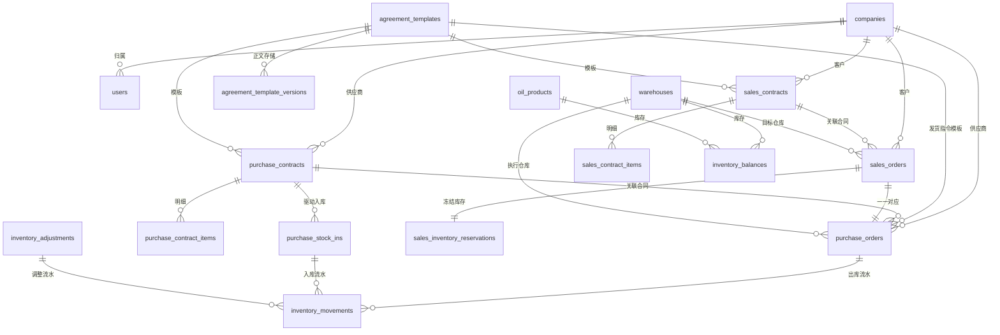

# 隽港顺达供应链项目 V5 数据库设计文档

## 1. 文档信息
- 版本：V5
- 更新日期：2026-03-02
- 状态：开发设计基线
- 适用范围：V5 销售订单、采购订单、合同、库存、附件、报表与审计建模

## 2. 设计目标
- 为 V5 双订单、合同、采购入库、库存调整、分域报表提供可直接落库的结构基线。
- 明确 V4 旧表与旧接口已归档，当前数据库设计仅服务 V5 新业务域。
- 优先保证成品油批发场景下的可执行性、可审计性、可追溯性和库存一致性。

## 3. 设计原则
### 3.1 业务原则
- 销售链和采购链分表建模，不再复用单一订单主表。
- 合同、订单、库存、附件、日志各自独立成域，通过外键和快照字段关联。
- 所有关键业务对象都必须同时保留“来源外键”和“历史快照”，避免源数据后改影响历史单据。
- 订单终止、库存释放、合同执行扣减必须具备审计留痕。
- 一张销售订单只对应一张采购订单，数据库层通过唯一约束固化。

### 3.2 技术原则
- 以下字段类型以 MySQL 8 为基准，开发环境若继续使用 SQLite，可按等价类型映射实现。
- 主键统一建议使用 `BIGINT UNSIGNED`，低频业务下仍保留足够扩展空间。
- 金额字段统一使用 `DECIMAL(18,2)`，吨位字段统一使用 `DECIMAL(18,4)`，禁止继续使用 `FLOAT` 存储业务金额和吨位。
- 时间字段统一使用 `DATETIME(3)` 或等价高精度时间类型。
- 状态字段统一使用 `VARCHAR(32)` + 应用层枚举，不依赖数据库原生 `ENUM`，便于后续演进。

### 3.3 迁移原则
- V5 作为全新系统上线，不做 V4 历史订单、合同、库存、报表数据迁移；V4 旧表、旧模型与旧接口均已归档，不参与当前 V5 运行时元数据、接口注册与测试基线。
- V5 新表统一使用新表名，避免和旧表同名造成迁移和联调歧义。
- 用户、微信绑定、激活码、SUPER_ADMIN 认证、业务日志等公共能力优先复用现有表结构，必要时增字段。

## 4. 数据域总览
| 数据域 | 核心表 | 用途 |
| --- | --- | --- |
| 组织与主数据 | `companies`、`warehouses`、`oil_products`、`users` | 公司、仓库、油品、业务角色基础数据 |
| 模板 | `agreement_templates`、`agreement_template_versions` | 发货指令单、采购合同、销售合同模板；业务上仅维护当前模板正文，`agreement_template_versions` 仅作内部兼容存储 |
| 合同 | `sales_contracts`、`sales_contract_items`、`purchase_contracts`、`purchase_contract_items` | 合同主档、数量金额、执行汇总、补差关系 |
| 订单 | `sales_orders`、`purchase_orders`、`customer_transport_profiles` | 销售单、采购单、一键带入运输资料 |
| 库存 | `inventory_balances`、`sales_inventory_reservations`、`inventory_movements`、`purchase_stock_ins`、`inventory_adjustments` | 库存余额、冻结、流水、入库、调整 |
| 附件 | `file_assets`、`file_asset_links` | 单据附件元数据和多文件关联 |
| 报表 | `report_exports` | 分域报表导出记录 |
| 审计 | `business_logs` | 关键动作、状态变更、异常关闭、库存释放审计 |

## 5. 核心枚举建议
### 5.1 公司类型
- `CUSTOMER`
- `SUPPLIER`
- `OPERATOR`
- `WAREHOUSE`

### 5.2 协议模板类型
- `DELIVERY_INSTRUCTION`
- `SALES_CONTRACT`
- `PURCHASE_CONTRACT`

### 5.3 合同状态
- `DRAFT`
- `PENDING_EFFECTIVE`
- `EFFECTIVE`
- `PARTIALLY_EXECUTED`
- `COMPLETED`
- `VOIDED`

### 5.4 合同类型
- `PRIMARY`
- `SUPPLEMENT`

### 5.5 销售订单状态
- `SUBMITTED`
- `OPERATOR_APPROVED`
- `CUSTOMER_PAYMENT_CONFIRMED`
- `READY_FOR_OUTBOUND`
- `COMPLETED`
- `REJECTED`
- `ABNORMAL_CLOSED`

### 5.6 采购订单状态
- `PENDING_SUBMIT`
- `SUPPLIER_PAYMENT_PENDING`
- `SUPPLIER_REVIEW_PENDING`
- `WAREHOUSE_PENDING`
- `COMPLETED`
- `ABNORMAL_CLOSED`

### 5.7 采购入库状态
- `PENDING_CONFIRM`
- `CONFIRMED`
- `VOIDED`

### 5.8 库存流水类型
- `PURCHASE_STOCK_IN`
- `PURCHASE_SUPPLEMENT_STOCK_IN`
- `SALES_RESERVE`
- `SALES_RESERVE_RELEASE`
- `SALES_OUTBOUND`
- `INVENTORY_ADJUSTMENT`

### 5.9 报表类型
- `SALES_ORDERS`
- `PURCHASE_ORDERS`
- `SALES_CONTRACTS`
- `PURCHASE_CONTRACTS`
- `INVENTORY_MOVEMENTS`
- `WAREHOUSE_LEDGER`

## 6. 表结构设计
## 6.1 组织与主数据
### 6.1.1 `companies`
用途：统一承接客户、供应商、运营公司等主体信息，替代散落在用户表和订单表中的名称字段。

| 字段 | 类型 | 约束 | 说明 |
| --- | --- | --- | --- |
| `id` | `BIGINT` | PK | 主键 |
| `company_code` | `VARCHAR(64)` | UNIQUE | 公司编码 |
| `company_name` | `VARCHAR(128)` | INDEX | 公司名称 |
| `company_type` | `VARCHAR(32)` | INDEX | 公司类型 |
| `tax_no` | `VARCHAR(64)` | NULL | 税号 |
| `contact_name` | `VARCHAR(64)` | NULL | 联系人 |
| `contact_phone` | `VARCHAR(32)` | NULL | 联系电话 |
| `address` | `VARCHAR(255)` | NULL | 地址 |
| `is_active` | `TINYINT(1)` | INDEX | 是否启用 |
| `created_at` | `DATETIME(3)` | NOT NULL | 创建时间 |
| `updated_at` | `DATETIME(3)` | NOT NULL | 更新时间 |

索引建议：
- 唯一索引：`uk_companies_code(company_code)`
- 普通索引：`idx_companies_type_name(company_type, company_name)`

### 6.1.2 `users`
用途：复用现有业务用户表，V5 建议新增 `company_id`，逐步替代旧 `customer_id` 语义。

新增/调整字段建议：
- `company_id BIGINT NULL`：所属公司
- `company_name_snapshot VARCHAR(128) NULL`：历史兼容字段，逐步废弃
- 保留 `role`、`status`、`username`、`display_name`

关键约束：
- `fk_users_company_id -> companies.id`
- 单用户只归属一个公司，符合当前低复杂度业务模型

### 6.1.3 `warehouses`
复用现有 `warehouses` 表，建议新增：
- `warehouse_code VARCHAR(64) UNIQUE`
- `company_id BIGINT NULL`：如后续需支持仓库所属公司

### 6.1.4 `oil_products`
复用现有 `oil_products` 表，建议新增：
- `product_code VARCHAR(64) UNIQUE`
- `unit_name VARCHAR(16)`，默认 `吨`

## 6.2 模板域
### 6.2.1 `agreement_templates`
用途：模板主档，承接每类模板当前生效正文与启停状态。

| 字段 | 类型 | 约束 | 说明 |
| --- | --- | --- | --- |
| `id` | `BIGINT` | PK | 主键 |
| `template_type` | `VARCHAR(32)` | INDEX | 模板类型 |
| `template_code` | `VARCHAR(64)` | UNIQUE | 模板编码 |
| `template_name` | `VARCHAR(128)` | NOT NULL | 模板名称 |
| `is_default` | `TINYINT(1)` | INDEX | 是否默认模板 |
| `status` | `VARCHAR(32)` | INDEX | `ENABLED` / `DISABLED` |
| `current_version_no` | `INT` | NOT NULL | 内部兼容字段，当前固定使用首版正文 |
| `remark` | `VARCHAR(255)` | NULL | 备注 |
| `created_by` | `BIGINT` | NOT NULL | 创建人 |
| `updated_by` | `BIGINT` | NOT NULL | 更新人 |
| `created_at` | `DATETIME(3)` | NOT NULL | 创建时间 |
| `updated_at` | `DATETIME(3)` | NOT NULL | 更新时间 |

关键约束：
- 同一 `template_type` 仅允许一个启用中的默认模板，建议使用应用层校验 + 唯一条件索引实现

### 6.2.2 `agreement_template_versions`
用途：内部兼容存储当前模板正文；当前业务不开放版本管理。

| 字段 | 类型 | 约束 | 说明 |
| --- | --- | --- | --- |
| `id` | `BIGINT` | PK | 主键 |
| `template_id` | `BIGINT` | FK | 模板主档 |
| `version_no` | `INT` | NOT NULL | 内部兼容字段，当前固定为 `1` |
| `template_title` | `VARCHAR(128)` | NULL | 模板标题 |
| `template_content_json` | `JSON` | NOT NULL | 固定条款与结构化内容 |
| `placeholder_schema_json` | `JSON` | NOT NULL | 占位符定义 |
| `render_config_json` | `JSON` | NOT NULL | PDF 样式、页脚、字号等配置 |
| `created_by` | `BIGINT` | NOT NULL | 创建人 |
| `created_at` | `DATETIME(3)` | NOT NULL | 创建时间 |

关键约束：
- 唯一索引：`uk_template_version(template_id, version_no)`；当前业务固定只保留 `version_no = 1`

## 6.3 合同域
### 6.3.1 `sales_contracts`
用途：销售合同主档，承接客户合同、生效附件、执行汇总和补差关系。

| 字段 | 类型 | 约束 | 说明 |
| --- | --- | --- | --- |
| `id` | `BIGINT` | PK | 主键 |
| `contract_no` | `VARCHAR(64)` | UNIQUE | 销售合同号 |
| `contract_kind` | `VARCHAR(16)` | INDEX | `PRIMARY` / `SUPPLEMENT` |
| `source_contract_id` | `BIGINT` | FK/NULL | 补差合同指向原合同 |
| `customer_company_id` | `BIGINT` | FK | 客户公司 |
| `template_id` | `BIGINT` | FK | 模板主档 |
| `template_version_id` | `BIGINT` | FK | 模板正文内部兼容引用 |
| `template_snapshot_json` | `JSON` | NOT NULL | 模板快照 |
| `variable_snapshot_json` | `JSON` | NOT NULL | 渲染变量快照 |
| `signed_contract_file_id` | `BIGINT` | FK/NULL | 盖章销售合同 |
| `deposit_receipt_file_id` | `BIGINT` | FK/NULL | 客户保证金回单 |
| `contract_date` | `DATE` | NOT NULL | 合同日期 |
| `effective_at` | `DATETIME(3)` | NULL | 生效时间 |
| `effective_by` | `BIGINT` | NULL | 生效人 |
| `voided_at` | `DATETIME(3)` | NULL | 作废时间 |
| `voided_by` | `BIGINT` | NULL | 作废人 |
| `status` | `VARCHAR(32)` | INDEX | 合同状态 |
| `deposit_rate` | `DECIMAL(5,4)` | NOT NULL | 默认 `0.1000` |
| `deposit_amount` | `DECIMAL(18,2)` | NOT NULL | 保证金金额 |
| `base_contract_qty` | `DECIMAL(18,4)` | NOT NULL | 原合同数量 |
| `supplement_qty_total` | `DECIMAL(18,4)` | NOT NULL | 补差累计数量 |
| `effective_contract_qty` | `DECIMAL(18,4)` | NOT NULL | 可执行总量 |
| `executed_qty` | `DECIMAL(18,4)` | NOT NULL | 已执行数量 |
| `pending_execution_qty` | `DECIMAL(18,4)` | NOT NULL | 待执行数量 |
| `over_executed_qty` | `DECIMAL(18,4)` | NOT NULL | 超执行数量 |
| `created_by` | `BIGINT` | NOT NULL | 创建人 |
| `updated_by` | `BIGINT` | NOT NULL | 更新人 |
| `created_at` | `DATETIME(3)` | NOT NULL | 创建时间 |
| `updated_at` | `DATETIME(3)` | NOT NULL | 更新时间 |

关键约束：
- `fk_sales_contract_source -> sales_contracts.id`
- 生效后不允许更新业务字段，建议通过服务层和数据库触发器双重控制

### 6.3.2 `sales_contract_items`
用途：销售合同项目明细；一期虽然一合同一油品，仍建议保留明细表以降低未来扩展成本。

| 字段 | 类型 | 约束 | 说明 |
| --- | --- | --- | --- |
| `id` | `BIGINT` | PK | 主键 |
| `sales_contract_id` | `BIGINT` | FK | 合同主档 |
| `product_id` | `BIGINT` | FK | 油品 |
| `qty_ton` | `DECIMAL(18,4)` | NOT NULL | 数量 |
| `unit_name` | `VARCHAR(16)` | NOT NULL | 单位，默认吨 |
| `tax_rate` | `DECIMAL(5,4)` | NOT NULL | 税率 |
| `unit_price_tax_included` | `DECIMAL(18,2)` | NOT NULL | 含税单价 |
| `amount_tax_included` | `DECIMAL(18,2)` | NOT NULL | 含税金额 |
| `amount_tax_excluded` | `DECIMAL(18,2)` | NOT NULL | 不含税金额 |
| `tax_amount` | `DECIMAL(18,2)` | NOT NULL | 税额 |
| `created_at` | `DATETIME(3)` | NOT NULL | 创建时间 |

关键约束：
- 一期建议唯一索引：`uk_sales_contract_product(sales_contract_id, product_id)`

### 6.3.3 `purchase_contracts`
用途：采购合同主档，结构与销售合同基本一致，增加入库累计字段。

除以下差异外，其余字段结构参考 `sales_contracts`：
- `supplier_company_id BIGINT NOT NULL`
- `stocked_in_qty DECIMAL(18,4) NOT NULL`
- `pending_stock_in_qty DECIMAL(18,4) NOT NULL`
- `deposit_receipt_file_id` 表示“付给供应商保证金回单”

### 6.3.4 `purchase_contract_items`
结构参考 `sales_contract_items`，主外键改为 `purchase_contract_id`。

### 6.3.5 `contract_execution_logs`
用途：记录每次出库或补差入库对合同执行量的影响，满足审计与报表重算。

| 字段 | 类型 | 约束 | 说明 |
| --- | --- | --- | --- |
| `id` | `BIGINT` | PK | 主键 |
| `contract_type` | `VARCHAR(32)` | INDEX | `SALES` / `PURCHASE` |
| `contract_id` | `BIGINT` | NOT NULL | 合同 ID |
| `business_type` | `VARCHAR(32)` | INDEX | `SALES_OUTBOUND` / `PURCHASE_STOCK_IN` / `SUPPLEMENT_STOCK_IN` |
| `business_id` | `BIGINT` | NOT NULL | 业务单据 ID |
| `qty_ton` | `DECIMAL(18,4)` | NOT NULL | 本次影响数量 |
| `before_executed_qty` | `DECIMAL(18,4)` | NOT NULL | 变更前已执行量 |
| `after_executed_qty` | `DECIMAL(18,4)` | NOT NULL | 变更后已执行量 |
| `before_pending_qty` | `DECIMAL(18,4)` | NOT NULL | 变更前待执行量 |
| `after_pending_qty` | `DECIMAL(18,4)` | NOT NULL | 变更后待执行量 |
| `operator_user_id` | `BIGINT` | NOT NULL | 操作人 |
| `created_at` | `DATETIME(3)` | NOT NULL | 创建时间 |

## 6.4 订单域
### 6.4.1 `customer_transport_profiles`
用途：客户历史运输资料池，支撑一键带入。

| 字段 | 类型 | 约束 | 说明 |
| --- | --- | --- | --- |
| `id` | `BIGINT` | PK | 主键 |
| `customer_company_id` | `BIGINT` | FK | 客户公司 |
| `transport_snapshot_json` | `JSON` | NOT NULL | 运输资料快照 |
| `is_default` | `TINYINT(1)` | INDEX | 默认资料 |
| `last_used_at` | `DATETIME(3)` | NULL | 最近使用时间 |
| `created_by` | `BIGINT` | NOT NULL | 创建人 |
| `created_at` | `DATETIME(3)` | NOT NULL | 创建时间 |
| `updated_at` | `DATETIME(3)` | NOT NULL | 更新时间 |

索引建议：
- `idx_transport_profiles_customer_last_used(customer_company_id, last_used_at DESC)`

### 6.4.2 `sales_orders`
用途：承接客户下单、运营审核、财务收款和对客户展示履约进度。

| 字段 | 类型 | 约束 | 说明 |
| --- | --- | --- | --- |
| `id` | `BIGINT` | PK | 主键 |
| `sales_order_no` | `VARCHAR(64)` | UNIQUE | 销售订单号 |
| `order_date` | `DATE` | INDEX | 订单日期 |
| `customer_company_id` | `BIGINT` | FK | 客户公司 |
| `warehouse_id` | `BIGINT` | FK | 目标仓库 |
| `product_id` | `BIGINT` | FK | 油品 |
| `sales_contract_id` | `BIGINT` | FK | 销售合同 |
| `sales_contract_snapshot_json` | `JSON` | NOT NULL | 销售合同快照 |
| `qty_ton` | `DECIMAL(18,4)` | NOT NULL | 订单数量 |
| `unit_price_tax_included` | `DECIMAL(18,2)` | NOT NULL | 销售单价快照 |
| `amount_tax_included` | `DECIMAL(18,2)` | NOT NULL | 销售金额快照 |
| `operator_company_id` | `BIGINT` | FK/NULL | 运营公司快照来源 |
| `operator_company_name_snapshot` | `VARCHAR(128)` | NULL | 报表口径快照 |
| `transport_profile_id` | `BIGINT` | FK/NULL | 来源历史运输资料 |
| `transport_snapshot_json` | `JSON` | NOT NULL | 提交时锁定的运输资料快照 |
| `received_amount` | `DECIMAL(18,2)` | NULL | 财务收款金额 |
| `customer_payment_receipt_file_id` | `BIGINT` | FK/NULL | 银行回单 |
| `reserved_qty_ton` | `DECIMAL(18,4)` | NOT NULL | 冻结库存数量 |
| `actual_outbound_qty_ton` | `DECIMAL(18,4)` | NOT NULL | 实际出库数量 |
| `status` | `VARCHAR(32)` | INDEX | 销售订单状态 |
| `operator_reviewed_by` | `BIGINT` | NULL | 运营审核人 |
| `operator_reviewed_at` | `DATETIME(3)` | NULL | 运营审核时间 |
| `finance_reviewed_by` | `BIGINT` | NULL | 财务审核人 |
| `finance_reviewed_at` | `DATETIME(3)` | NULL | 财务审核时间 |
| `closed_reason` | `VARCHAR(255)` | NULL | 驳回/异常关闭原因 |
| `closed_by` | `BIGINT` | NULL | 终止操作人 |
| `closed_at` | `DATETIME(3)` | NULL | 终止时间 |
| `created_by` | `BIGINT` | NOT NULL | 客户创建人 |
| `created_at` | `DATETIME(3)` | NOT NULL | 创建时间 |
| `updated_at` | `DATETIME(3)` | NOT NULL | 更新时间 |

关键约束：
- 唯一索引：`uk_sales_order_no(sales_order_no)`
- 索引：`idx_sales_orders_customer_status(customer_company_id, status, order_date DESC)`
- 状态约束：`REJECTED`、`ABNORMAL_CLOSED` 仅允许业务管理员置入

### 6.4.3 `purchase_orders`
用途：承接采购合同确认、向供应商付款、供应商确认、仓库出库。

| 字段 | 类型 | 约束 | 说明 |
| --- | --- | --- | --- |
| `id` | `BIGINT` | PK | 主键 |
| `purchase_order_no` | `VARCHAR(64)` | UNIQUE | 采购订单号 |
| `sales_order_id` | `BIGINT` | FK/UNIQUE | 与销售订单一一对应 |
| `purchase_contract_id` | `BIGINT` | FK/NULL | 采购合同，待提交时可为空 |
| `purchase_contract_snapshot_json` | `JSON` | NULL | 合同确认后锁定 |
| `supplier_company_id` | `BIGINT` | FK/NULL | 供应商公司 |
| `warehouse_id` | `BIGINT` | FK | 执行仓库 |
| `product_id` | `BIGINT` | FK | 油品 |
| `qty_ton` | `DECIMAL(18,4)` | NOT NULL | 数量，来源销售订单，不允许修改 |
| `unit_price_tax_included` | `DECIMAL(18,2)` | NULL | 采购单价快照 |
| `amount_tax_included` | `DECIMAL(18,2)` | NULL | 采购金额快照 |
| `confirm_snapshot_json` | `JSON` | NULL | 自动选合同/手工改选确认快照 |
| `confirm_acknowledged` | `TINYINT(1)` | NOT NULL | 是否完成二次确认 |
| `delivery_instruction_template_id` | `BIGINT` | FK/NULL | 发货指令模板 |
| `delivery_instruction_template_version_id` | `BIGINT` | FK/NULL | 模板正文内部兼容引用 |
| `delivery_instruction_template_snapshot_json` | `JSON` | NULL | 模板快照 |
| `delivery_instruction_pdf_file_id` | `BIGINT` | FK/NULL | 系统生成的发货指令单 PDF |
| `supplier_payment_voucher_file_id` | `BIGINT` | FK/NULL | 向供应商付款凭证 |
| `supplier_delivery_doc_file_id` | `BIGINT` | FK/NULL | 供应商盖章发货指令单 |
| `outbound_doc_file_id` | `BIGINT` | FK/NULL | 仓库出库单 |
| `actual_outbound_qty_ton` | `DECIMAL(18,4)` | NOT NULL | 实际出库数量 |
| `status` | `VARCHAR(32)` | INDEX | 采购订单状态 |
| `contract_confirmed_by` | `BIGINT` | NULL | 财务确认人 |
| `contract_confirmed_at` | `DATETIME(3)` | NULL | 财务确认时间 |
| `supplier_paid_by` | `BIGINT` | NULL | 上传付款凭证人 |
| `supplier_paid_at` | `DATETIME(3)` | NULL | 上传付款凭证时间 |
| `supplier_reviewed_by` | `BIGINT` | NULL | 供应商确认人 |
| `supplier_reviewed_at` | `DATETIME(3)` | NULL | 供应商确认时间 |
| `warehouse_reviewed_by` | `BIGINT` | NULL | 仓库出库人 |
| `warehouse_reviewed_at` | `DATETIME(3)` | NULL | 仓库出库时间 |
| `closed_reason` | `VARCHAR(255)` | NULL | 驳回/异常关闭原因 |
| `closed_by` | `BIGINT` | NULL | 终止操作人 |
| `closed_at` | `DATETIME(3)` | NULL | 终止时间 |
| `created_at` | `DATETIME(3)` | NOT NULL | 创建时间 |
| `updated_at` | `DATETIME(3)` | NOT NULL | 更新时间 |

关键约束：
- 唯一索引：`uk_purchase_order_no(purchase_order_no)`
- 唯一索引：`uk_purchase_order_sales_order(sales_order_id)`
- 索引：`idx_purchase_orders_status_supplier(status, supplier_company_id, warehouse_id)`
- 状态迁移：
  - 财务收款通过后自动建单，默认 `PENDING_SUBMIT`
  - 确认合同和模板后进入 `SUPPLIER_PAYMENT_PENDING`
  - 上传付款凭证后进入 `SUPPLIER_REVIEW_PENDING`
  - 供应商确认后进入 `WAREHOUSE_PENDING`

## 6.5 库存域
### 6.5.1 `inventory_balances`
用途：仓库+油品维度库存余额。

| 字段 | 类型 | 约束 | 说明 |
| --- | --- | --- | --- |
| `id` | `BIGINT` | PK | 主键 |
| `warehouse_id` | `BIGINT` | FK | 仓库 |
| `product_id` | `BIGINT` | FK | 油品 |
| `on_hand_qty_ton` | `DECIMAL(18,4)` | NOT NULL | 账面库存 |
| `reserved_qty_ton` | `DECIMAL(18,4)` | NOT NULL | 冻结库存 |
| `available_qty_ton` | `DECIMAL(18,4)` | NOT NULL | 可用库存，建议持久化冗余 |
| `last_movement_at` | `DATETIME(3)` | NULL | 最近变动时间 |
| `created_at` | `DATETIME(3)` | NOT NULL | 创建时间 |
| `updated_at` | `DATETIME(3)` | NOT NULL | 更新时间 |

关键约束：
- 唯一索引：`uk_inventory_balance_wh_product(warehouse_id, product_id)`

### 6.5.2 `sales_inventory_reservations`
用途：销售订单冻结库存记录。

| 字段 | 类型 | 约束 | 说明 |
| --- | --- | --- | --- |
| `id` | `BIGINT` | PK | 主键 |
| `sales_order_id` | `BIGINT` | FK/UNIQUE | 对应销售订单 |
| `inventory_balance_id` | `BIGINT` | FK | 对应库存余额 |
| `reserved_qty_ton` | `DECIMAL(18,4)` | NOT NULL | 冻结数量 |
| `status` | `VARCHAR(32)` | INDEX | `ACTIVE` / `RELEASED` / `CONSUMED` |
| `reserved_at` | `DATETIME(3)` | NOT NULL | 冻结时间 |
| `released_at` | `DATETIME(3)` | NULL | 释放时间 |
| `released_reason` | `VARCHAR(255)` | NULL | 释放原因 |
| `created_by` | `BIGINT` | NOT NULL | 创建人 |
| `updated_at` | `DATETIME(3)` | NOT NULL | 更新时间 |

### 6.5.3 `inventory_movements`
用途：库存流水台账，是报表和审计的最终口径来源。

| 字段 | 类型 | 约束 | 说明 |
| --- | --- | --- | --- |
| `id` | `BIGINT` | PK | 主键 |
| `movement_no` | `VARCHAR(64)` | UNIQUE | 流水号 |
| `warehouse_id` | `BIGINT` | FK | 仓库 |
| `product_id` | `BIGINT` | FK | 油品 |
| `movement_type` | `VARCHAR(32)` | INDEX | 流水类型 |
| `business_type` | `VARCHAR(32)` | INDEX | 来源单据类型 |
| `business_id` | `BIGINT` | NOT NULL | 来源单据 ID |
| `before_on_hand_qty_ton` | `DECIMAL(18,4)` | NOT NULL | 变更前账面库存 |
| `change_qty_ton` | `DECIMAL(18,4)` | NOT NULL | 变更量 |
| `after_on_hand_qty_ton` | `DECIMAL(18,4)` | NOT NULL | 变更后账面库存 |
| `before_reserved_qty_ton` | `DECIMAL(18,4)` | NOT NULL | 变更前冻结库存 |
| `after_reserved_qty_ton` | `DECIMAL(18,4)` | NOT NULL | 变更后冻结库存 |
| `remark` | `VARCHAR(255)` | NULL | 备注 |
| `operator_user_id` | `BIGINT` | NOT NULL | 操作人 |
| `created_at` | `DATETIME(3)` | NOT NULL | 创建时间 |

索引建议：
- `idx_inventory_movements_wh_product_time(warehouse_id, product_id, created_at DESC)`
- `idx_inventory_movements_business(business_type, business_id)`

### 6.5.4 `purchase_stock_ins`
用途：采购合同驱动的入库单，不由采购订单触发。

| 字段 | 类型 | 约束 | 说明 |
| --- | --- | --- | --- |
| `id` | `BIGINT` | PK | 主键 |
| `stock_in_no` | `VARCHAR(64)` | UNIQUE | 入库单号 |
| `purchase_contract_id` | `BIGINT` | FK | 采购合同 |
| `warehouse_id` | `BIGINT` | FK | 入库仓库 |
| `product_id` | `BIGINT` | FK | 油品 |
| `stock_in_qty_ton` | `DECIMAL(18,4)` | NOT NULL | 入库数量 |
| `stock_in_date` | `DATE` | NULL | 入库日期 |
| `status` | `VARCHAR(32)` | INDEX | 入库状态 |
| `source_kind` | `VARCHAR(32)` | INDEX | `PRIMARY_AUTO` / `SUPPLEMENT_AUTO` / `MANUAL_APPEND` |
| `remark` | `VARCHAR(255)` | NULL | 备注 |
| `confirmed_by` | `BIGINT` | NULL | 确认人 |
| `confirmed_at` | `DATETIME(3)` | NULL | 确认时间 |
| `created_at` | `DATETIME(3)` | NOT NULL | 创建时间 |
| `updated_at` | `DATETIME(3)` | NOT NULL | 更新时间 |

### 6.5.5 `inventory_adjustments`
用途：历史初始化和特殊修正，不替代采购入库和仓库出库。

| 字段 | 类型 | 约束 | 说明 |
| --- | --- | --- | --- |
| `id` | `BIGINT` | PK | 主键 |
| `adjustment_no` | `VARCHAR(64)` | UNIQUE | 调整单号 |
| `warehouse_id` | `BIGINT` | FK | 仓库 |
| `product_id` | `BIGINT` | FK | 油品 |
| `adjust_type` | `VARCHAR(32)` | INDEX | `INITIALIZE` / `INCREASE` / `DECREASE` |
| `before_qty_ton` | `DECIMAL(18,4)` | NOT NULL | 调整前数量 |
| `adjust_qty_ton` | `DECIMAL(18,4)` | NOT NULL | 调整数量 |
| `after_qty_ton` | `DECIMAL(18,4)` | NOT NULL | 调整后数量 |
| `reason` | `VARCHAR(255)` | NOT NULL | 调整原因 |
| `created_by` | `BIGINT` | NOT NULL | 创建人 |
| `created_at` | `DATETIME(3)` | NOT NULL | 创建时间 |

## 6.6 附件域
### 6.6.1 `file_assets`
用途：统一附件元数据，业务表只保存附件 ID。

| 字段 | 类型 | 约束 | 说明 |
| --- | --- | --- | --- |
| `id` | `BIGINT` | PK | 主键 |
| `file_key` | `VARCHAR(255)` | UNIQUE | 对象存储键 |
| `business_type` | `VARCHAR(64)` | INDEX | 附件业务类型 |
| `file_name` | `VARCHAR(255)` | NOT NULL | 原始文件名 |
| `content_type` | `VARCHAR(128)` | NOT NULL | MIME 类型 |
| `file_size_bytes` | `BIGINT` | NOT NULL | 大小 |
| `storage_backend` | `VARCHAR(32)` | NOT NULL | `LOCAL` / `OSS` |
| `uploaded_by` | `BIGINT` | NOT NULL | 上传人 |
| `created_at` | `DATETIME(3)` | NOT NULL | 创建时间 |

### 6.6.2 `file_asset_links`
用途：承接多附件关系，如运输附件。

| 字段 | 类型 | 约束 | 说明 |
| --- | --- | --- | --- |
| `id` | `BIGINT` | PK | 主键 |
| `entity_type` | `VARCHAR(32)` | INDEX | `SALES_ORDER` / `PURCHASE_ORDER` / `CONTRACT` |
| `entity_id` | `BIGINT` | NOT NULL | 业务主键 |
| `field_name` | `VARCHAR(64)` | INDEX | 关联字段，如 `transport_files` |
| `file_asset_id` | `BIGINT` | FK | 附件 |
| `sort_no` | `INT` | NOT NULL | 排序 |
| `created_at` | `DATETIME(3)` | NOT NULL | 创建时间 |

## 6.7 报表域
### 6.7.1 `report_exports`
用途：统一承接销售、采购、合同、库存等报表导出记录。

| 字段 | 类型 | 约束 | 说明 |
| --- | --- | --- | --- |
| `id` | `BIGINT` | PK | 主键 |
| `report_type` | `VARCHAR(32)` | INDEX | 报表类型 |
| `generated_by` | `BIGINT` | NOT NULL | 生成用户 |
| `generator_role` | `VARCHAR(32)` | INDEX | 生成角色 |
| `scope_company_id` | `BIGINT` | NULL | 客户/供应商公司范围 |
| `warehouse_id` | `BIGINT` | NULL | 仓库台账范围 |
| `from_date` | `DATE` | NULL | 查询起始日期 |
| `to_date` | `DATE` | NULL | 查询结束日期 |
| `filters_json` | `JSON` | NOT NULL | 查询条件 |
| `field_profile_json` | `JSON` | NOT NULL | 字段裁剪快照 |
| `file_asset_id` | `BIGINT` | FK | 导出文件 |
| `row_count` | `INT` | NOT NULL | 行数 |
| `status` | `VARCHAR(32)` | INDEX | `GENERATED` / `FAILED` |
| `summary_json` | `JSON` | NULL | 汇总信息 |
| `created_at` | `DATETIME(3)` | NOT NULL | 创建时间 |

## 6.8 审计与日志
### 6.8.1 `business_logs`
用途：复用现有业务日志表，建议扩展以覆盖 V5 多实体对象。

建议新增/强化字段：
- `entity_type VARCHAR(32)`：`SALES_ORDER` / `PURCHASE_ORDER` / `SALES_CONTRACT` / `PURCHASE_CONTRACT` / `PURCHASE_STOCK_IN` / `INVENTORY_ADJUSTMENT`
- `entity_id BIGINT`
- `before_status VARCHAR(32)`
- `after_status VARCHAR(32)`
- `reason VARCHAR(255)`
- `detail_json JSON`

用途说明：
- 订单驳回、异常关闭、库存释放、合同生效、合同作废、采购入库确认、库存调整都写入本表。
- V5 不再新增多套零散日志表，优先用统一日志表承接审计。

## 7. 关键关系图

## 8. 关键事务与一致性要求
### 8.1 运营审核通过
一个事务内完成：
1. 更新 `sales_orders.status = OPERATOR_APPROVED`
2. 创建或更新 `sales_inventory_reservations`
3. 更新库存冻结汇总字段
4. 写入 `business_logs`

### 8.2 财务审核通过
一个事务内完成：
1. 更新 `sales_orders.status = CUSTOMER_PAYMENT_CONFIRMED`
2. 写入收款金额和回单附件
3. 创建 `purchase_orders`
4. 写入 `business_logs`

### 8.3 采购订单提交
一个事务内完成：
1. 绑定 `purchase_contract_id`
2. 固化合同确认快照
3. 固化发货指令模板快照
4. 生成发货指令单 PDF 附件
5. 更新 `purchase_orders.status = SUPPLIER_PAYMENT_PENDING`
6. 写入 `business_logs`

### 8.4 上传向供应商付款凭证
一个事务内完成：
1. 写入付款凭证附件
2. 更新 `purchase_orders.status = SUPPLIER_REVIEW_PENDING`
3. 写入 `business_logs`

### 8.5 供应商确认通过
一个事务内完成：
1. 写入盖章发货指令单附件
2. 更新 `purchase_orders.status = WAREHOUSE_PENDING`
3. 更新 `sales_orders.status = READY_FOR_OUTBOUND`
4. 写入 `business_logs`

### 8.6 仓库出库完成
一个事务内完成：
1. 校验 `inventory_balances.available_qty_ton >= sales_orders.reserved_qty_ton`
2. 写入出库附件
3. 更新销售订单、采购订单完成状态
4. 消耗 `sales_inventory_reservations`
5. 写入 `inventory_movements`
6. 更新 `inventory_balances`
7. 更新销售合同、采购合同执行汇总
8. 写入 `contract_execution_logs`
9. 写入 `business_logs`

### 8.7 管理员驳回或异常关闭
一个事务内完成：
1. 销售订单收款前驳回或收款后异常关闭
2. 如已生成采购订单，同步更新 `purchase_orders.status = ABNORMAL_CLOSED`
3. 释放 `sales_inventory_reservations`
4. 写入库存释放流水
5. 写入关闭原因和操作人
6. 写入 `business_logs`

## 9. 索引与性能建议
- 所有单号字段均建立唯一索引：合同号、订单号、入库单号、调整单号、库存流水号、报表导出号。
- 订单列表核心索引：
  - `sales_orders(customer_company_id, status, order_date desc)`
  - `purchase_orders(status, supplier_company_id, warehouse_id, updated_at desc)`
- 报表查询核心索引：
  - `sales_orders(order_date, status)`
  - `purchase_orders(updated_at, status)`
  - `inventory_movements(created_at, warehouse_id, product_id)`
- 日志查询核心索引：
  - `business_logs(entity_type, entity_id, created_at desc)`
  - `business_logs(action, created_at desc)`

## 10. 开发落地顺序建议
1. 先建主数据扩展表：`companies`、`agreement_templates`，并保留 `agreement_template_versions` 作为内部兼容存储
2. 再建合同域：销售合同、采购合同、合同明细、合同执行日志
3. 再建订单域：销售订单、采购订单、运输资料历史
4. 再建库存域：库存余额、冻结、流水、采购入库、库存调整
5. 再建附件和报表表
6. 最后处理初始化数据准备脚本与归档目录说明

## 11. 与现有系统的接入边界
- 当前 V5 运行期仅接入以下公共能力表：
  - `users`
  - `wechat_accounts`
  - `activation_codes`
  - `super_admin_*`
  - `business_logs`
- 已归档的 V4 旧表、旧模型、旧接口不再作为当前元数据、接口注册或测试基线的一部分。

## 12. 当前结论
- 当前业务规则已经足以支撑进入数据库建模阶段。
- 本文档可作为 Alembic 首轮 V5 建表迁移和 SQLAlchemy 模型重构的直接依据。
- 当前数据库设计已与 `V5状态机定义文档`、`V5接口设计文档`、`需求方案` 完成基线对齐。
