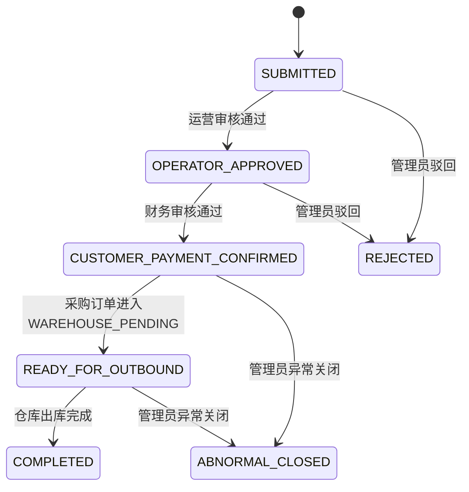
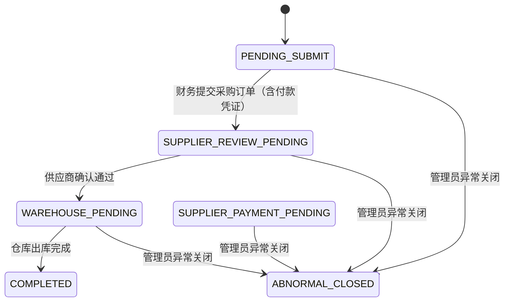
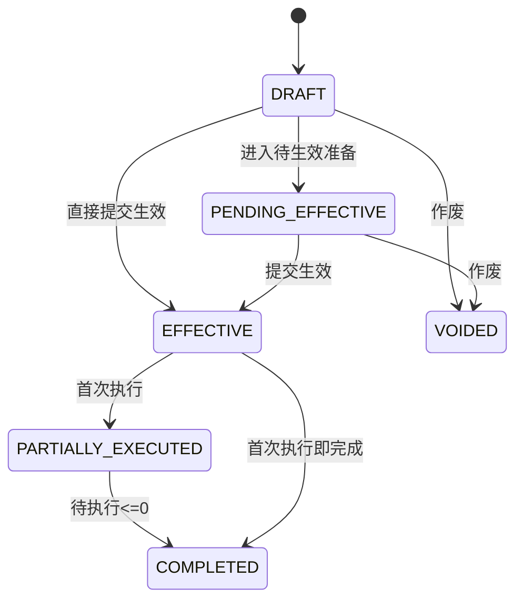
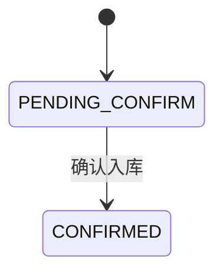

# 隽港顺达供应链项目 V5 状态机定义文档

## 1. 文档信息
- 版本：V5
- 更新日期：2026-03-01
- 状态：开发设计基线
- 适用范围：V5 销售订单、采购订单、合同、采购入库状态流转与联动实现

## 2. 目标
- 把 V5 双订单、合同、采购入库的状态流转固化为单一实现依据。
- 明确每个动作的角色、前置条件、目标状态和联动副作用。
- 避免开发阶段由页面或接口各自解释状态含义，导致流程分叉。

## 3. 全局规则
- 状态流转必须由统一状态机服务处理，控制器和页面不得直接改状态。
- 文档内定义的终态均不可回流，系统不支持原单重开。
- 订单终止类动作仅允许 `ADMIN` 执行；销售订单仅在客户收款确认前允许驳回，客户收款确认后及全部采购订单仅允许异常关闭。
- `SUPER_ADMIN` 不参与业务状态流转，仅管理配置、模板、用户、主数据和审计查看。
- 一张销售订单固定对应一张采购订单，采购单的关键状态变化需同步回写销售订单。
- 所有状态变化都必须写入 `business_logs`，关键订单动作同时写入订单维度历史记录。

## 4. 销售订单状态机
## 4.1 状态定义
| 状态 | 含义 | 是否终态 |
| --- | --- | --- |
| `SUBMITTED` | 客户已提交，待运营审核 | 否 |
| `OPERATOR_APPROVED` | 运营审核通过，待财务审核 | 否 |
| `CUSTOMER_PAYMENT_CONFIRMED` | 财务已确认收款，采购执行中 | 否 |
| `READY_FOR_OUTBOUND` | 关联采购订单已进入仓库待出库 | 否 |
| `COMPLETED` | 已完成 | 是 |
| `REJECTED` | 客户收款确认前已驳回 | 是 |
| `ABNORMAL_CLOSED` | 异常关闭 | 是 |

## 4.2 状态图

## 4.3 流转表
| 当前状态 | 动作 | 执行角色 | 前置条件 | 目标状态 | 联动结果 |
| --- | --- | --- | --- | --- | --- |
| `SUBMITTED` | 运营审核通过 | `OPERATOR` | 销售合同有效；运输资料已锁定 | `OPERATOR_APPROVED` | 冻结库存；写日志 |
| `OPERATOR_APPROVED` | 财务审核通过 | `FINANCE` | 已填写收款金额；已上传客户收款凭证 | `CUSTOMER_PAYMENT_CONFIRMED` | 创建采购订单；销售订单保留；写日志 |
| `CUSTOMER_PAYMENT_CONFIRMED` | 采购订单进入仓库待出库 | 系统联动 | 关联采购订单状态变为 `WAREHOUSE_PENDING` | `READY_FOR_OUTBOUND` | 更新销售订单可视进度；写日志 |
| `READY_FOR_OUTBOUND` | 仓库出库完成 | 系统联动 | 关联采购订单完成一次出库 | `COMPLETED` | 同步完成销售订单；扣减合同执行量；写日志 |
| `SUBMITTED`、`OPERATOR_APPROVED` | 管理员驳回 | `ADMIN` | 客户收款尚未确认 | `REJECTED` | 如已冻结库存则释放；写日志 |
| `CUSTOMER_PAYMENT_CONFIRMED`、`READY_FOR_OUTBOUND` | 管理员异常关闭 | `ADMIN` | 采购执行失败、合同选错等异常已发生 | `ABNORMAL_CLOSED` | 联动关闭采购订单；释放冻结库存；写日志 |

## 4.4 销售订单状态副作用
- 从 `SUBMITTED` 进入 `OPERATOR_APPROVED` 时：
  - 创建或更新 `sales_inventory_reservations`
  - 更新库存余额中的 `reserved_qty_ton`
- 从 `OPERATOR_APPROVED` 进入 `CUSTOMER_PAYMENT_CONFIRMED` 时：
  - 写入收款金额和收款凭证附件
  - 自动生成一张关联采购订单
- 从 `CUSTOMER_PAYMENT_CONFIRMED` 进入 `READY_FOR_OUTBOUND` 时：
  - 不再新增库存动作，仅更新可见进度
- 从 `READY_FOR_OUTBOUND` 进入 `COMPLETED` 时：
  - 以实际出库量完成销售订单
  - 销售合同 `executed_qty` 累加
- 进入 `REJECTED` 或 `ABNORMAL_CLOSED` 时：
  - 如已冻结库存必须释放
  - 不允许再恢复为执行态

## 5. 采购订单状态机
## 5.1 状态定义
- 采购订单在客户收款确认后才生成，因此不设置驳回状态。
- `SUPPLIER_PAYMENT_PENDING` 状态保留用于历史兼容；当前新单提交路径已由“提交时同步上传付款凭证”合并，不再进入该状态。

| 状态 | 含义 | 是否终态 |
| --- | --- | --- |
| `PENDING_SUBMIT` | 待补录采购合同或待提交 | 否 |
| `SUPPLIER_PAYMENT_PENDING` | 已确认合同和模板，待上传向供应商付款凭证 | 否 |
| `SUPPLIER_REVIEW_PENDING` | 已上传向供应商付款凭证，待供应商确认 | 否 |
| `WAREHOUSE_PENDING` | 供应商已确认，待仓库出库 | 否 |
| `COMPLETED` | 已完成 | 是 |
| `ABNORMAL_CLOSED` | 异常关闭 | 是 |

## 5.2 状态图

## 5.3 流转表
| 当前状态 | 动作 | 执行角色 | 前置条件 | 目标状态 | 联动结果 |
| --- | --- | --- | --- | --- | --- |
| `PENDING_SUBMIT` | 财务提交采购订单 | `FINANCE` | 已选择采购合同；已完成合同二次确认；已选择发货指令单模板；已上传向供应商付款凭证 | `SUPPLIER_REVIEW_PENDING` | 固化合同确认快照；生成发货指令单 PDF；写日志 |
| `SUPPLIER_REVIEW_PENDING` | 供应商确认通过 | `SUPPLIER` | 已查看系统发货指令单；已上传盖章发货指令单 | `WAREHOUSE_PENDING` | 销售订单同步进入 `READY_FOR_OUTBOUND`；写日志 |
| `WAREHOUSE_PENDING` | 仓库出库完成 | `WAREHOUSE` | 可用库存充足；已上传出库单；实际出库量等于订单量 | `COMPLETED` | 销售订单同步完成；扣减库存和合同执行量；写日志 |
| `PENDING_SUBMIT`、`SUPPLIER_PAYMENT_PENDING`、`SUPPLIER_REVIEW_PENDING`、`WAREHOUSE_PENDING` | 管理员异常关闭 | `ADMIN` | 采购执行失败、采购合同选错等异常已发生 | `ABNORMAL_CLOSED` | 联动销售订单异常关闭；释放冻结库存；写日志 |

## 5.4 采购订单状态副作用
- 从 `PENDING_SUBMIT` 进入 `SUPPLIER_REVIEW_PENDING` 时：
  - 固化采购合同快照
  - 固化发货指令模板快照
  - 生成并绑定发货指令单 PDF
- 从 `SUPPLIER_REVIEW_PENDING` 进入 `WAREHOUSE_PENDING` 时：
  - 销售订单同步进入 `READY_FOR_OUTBOUND`
- 从 `WAREHOUSE_PENDING` 进入 `COMPLETED` 时：
  - 库存实扣
  - 采购合同 `executed_qty` 累加
  - 采购订单与销售订单同时完成

## 6. 合同状态机
## 6.1 通用规则
- 销售合同和采购合同共用同一组状态语义。
- 合同生效后不允许修改。
- 合同关联合同订单、采购入库、仓库出库等任一业务单据后，不允许作废。
- 补差合同使用与主合同相同状态机，但 `contract_kind = SUPPLEMENT`。

## 6.2 状态定义
| 状态 | 含义 | 是否终态 |
| --- | --- | --- |
| `DRAFT` | 草稿，可编辑 | 否 |
| `PENDING_EFFECTIVE` | 待生效准备中，可编辑 | 否 |
| `EFFECTIVE` | 已生效，尚未执行或未达到部分执行阈值 | 否 |
| `PARTIALLY_EXECUTED` | 已有执行记录，但未完成 | 否 |
| `COMPLETED` | 待执行数量小于等于 0 | 是 |
| `VOIDED` | 已作废 | 是 |

## 6.3 合同状态图

## 6.4 销售合同流转表
| 当前状态 | 动作 | 执行角色 | 前置条件 | 目标状态 | 联动结果 |
| --- | --- | --- | --- | --- | --- |
| `DRAFT` | 保存草稿 | `FINANCE`、`OPERATOR`、`ADMIN` | 基本字段合法 | `DRAFT` | 更新草稿 |
| `DRAFT` | 进入待生效准备 | `FINANCE`、`OPERATOR`、`ADMIN` | 已开始上传生效附件或生成 PDF | `PENDING_EFFECTIVE` | 写日志 |
| `DRAFT`、`PENDING_EFFECTIVE` | 提交生效 | `FINANCE`、`OPERATOR`、`ADMIN` | 已上传盖章销售合同；已上传客户保证金回单 | `EFFECTIVE` | 固化模板快照；写日志 |
| `DRAFT`、`PENDING_EFFECTIVE` | 作废 | `FINANCE`、`OPERATOR`、`ADMIN` | 未关联合同订单、采购入库、仓库出库 | `VOIDED` | 写日志 |
| `EFFECTIVE` | 首次实际执行 | 系统联动 | 首次出库成功 | `PARTIALLY_EXECUTED` 或 `COMPLETED` | 更新执行汇总 |
| `PARTIALLY_EXECUTED` | 累计执行完成 | 系统联动 | 待执行数量 <= 0 | `COMPLETED` | 更新执行汇总 |

## 6.5 采购合同流转表
与销售合同流转一致，差异点如下：
- 生效前附件改为“盖章采购合同 + 付给供应商保证金回单”
- 生效后自动生成一张 `purchase_stock_ins`
- 首次确认采购入库不会直接改变合同完成状态，只更新 `stocked_in_qty`
- 采购合同状态完成仍以实际出库执行量为准，不以入库完成为准

## 7. 采购入库状态机
## 7.1 状态定义
| 状态 | 含义 | 是否终态 |
| --- | --- | --- |
| `PENDING_CONFIRM` | 已生成，待确认入库 | 否 |
| `CONFIRMED` | 已确认入库并增加库存 | 是 |
| `VOIDED` | 已作废，未入库存量（状态预留，当前版本未开放作废动作） | 是 |

## 7.2 状态图

## 7.3 流转表
| 当前状态 | 动作 | 执行角色 | 前置条件 | 目标状态 | 联动结果 |
| --- | --- | --- | --- | --- | --- |
| `PENDING_CONFIRM` | 确认入库 | `FINANCE`、`ADMIN` | 已填写仓库、油品、入库数量、入库日期；数量未超过合同待入库量 | `CONFIRMED` | 增加库存；写入库存流水；更新采购合同 `stocked_in_qty` |

## 8. 跨对象联动矩阵
| 触发对象 | 触发动作 | 被联动对象 | 联动结果 |
| --- | --- | --- | --- |
| 销售订单 | 财务审核通过 | 采购订单 | 自动创建 `PENDING_SUBMIT` 采购订单 |
| 采购订单 | 进入 `WAREHOUSE_PENDING` | 销售订单 | 销售订单进入 `READY_FOR_OUTBOUND` |
| 采购订单 | 仓库出库完成 | 销售订单 | 销售订单进入 `COMPLETED` |
| 采购订单 | 管理员异常关闭 | 销售订单 | 销售订单进入 `ABNORMAL_CLOSED` |
| 销售订单 | 管理员驳回（收款前） | 采购订单 | 不触发采购订单联动 |
| 销售订单 | 管理员异常关闭（收款后） | 采购订单 | 如已生成采购订单，同步进入 `ABNORMAL_CLOSED` |
| 采购合同 | 提交生效 | 采购入库 | 自动生成 `PENDING_CONFIRM` 入库单 |
| 仓库出库 | 完成 | 库存、合同 | 库存实扣；销售/采购合同执行量累加 |

## 9. 实现强制要求
- 所有状态流转前必须校验“当前状态 + 执行角色 + 前置条件”三件套。
- 终态对象禁止再次发起任何业务流转动作。
- 状态流转与副作用必须放在同一数据库事务中。
- 状态机服务必须输出统一错误码，至少覆盖：
  - 当前状态不允许该动作
  - 当前角色无权限
  - 必填附件缺失
  - 可用库存不足
  - 合同未生效或已作废
- 页面层只展示当前允许动作，不得展示后端一定会拒绝的按钮。

## 10. 当前结论
- 当前 V5 业务规则已经足以冻结核心状态机定义。
- 本文档可直接作为后端状态流转服务、权限校验和联调用例的实现基线。
- 下一步可进入：数据库迁移脚本设计、SQLAlchemy 模型拆分、状态机服务实现。
