# V6 阶段A交付件：流程图、状态机与UI原型清单（已冻结）

## 1. 文档定位
- 文档状态：`已冻结`
- 目标：冻结业务流、状态流、端能力边界，为阶段B详细设计与原型冻结提供输入。
- 适用范围：管理后台（全业务）与小程序（移动轻量业务）。
- 规则基线：`docs/需求方案.md` 当前 `1~69` 条及“业务目标与场景/角色与权限边界”章节。

## 1.1 角色口径说明
- 业务角色固定为：客户、运营、财务、供应商、仓库；系统管理员归属运营商公司。
- 本文中“管理层/审计”仅表示使用视角，不新增独立业务角色，实际由运营/财务/管理员权限组合承载。
- 客户、供应商、仓库角色用户仅在小程序端处理业务，不开放管理后台登录权限。

## 2. 端到端流程图

### 2.1 采购合同主流程（合同生效触发）
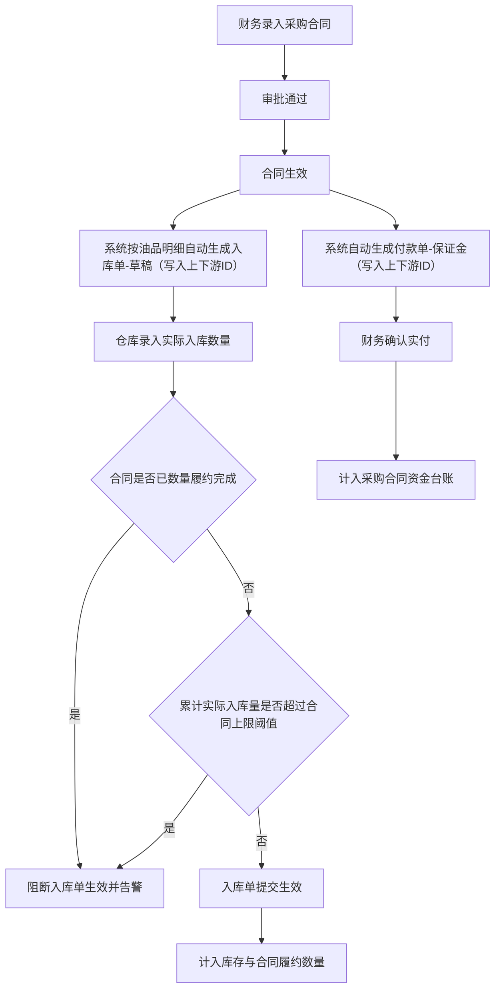

### 2.2 销售合同与销售订单主流程
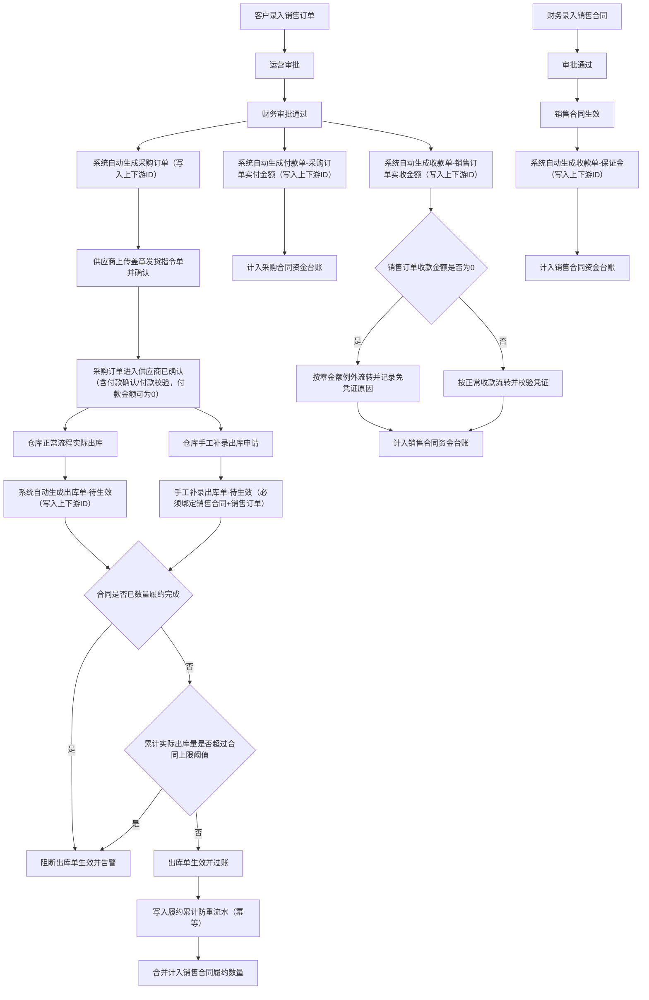

### 2.3 销售订单衍生采购订单“零付款”例外流程
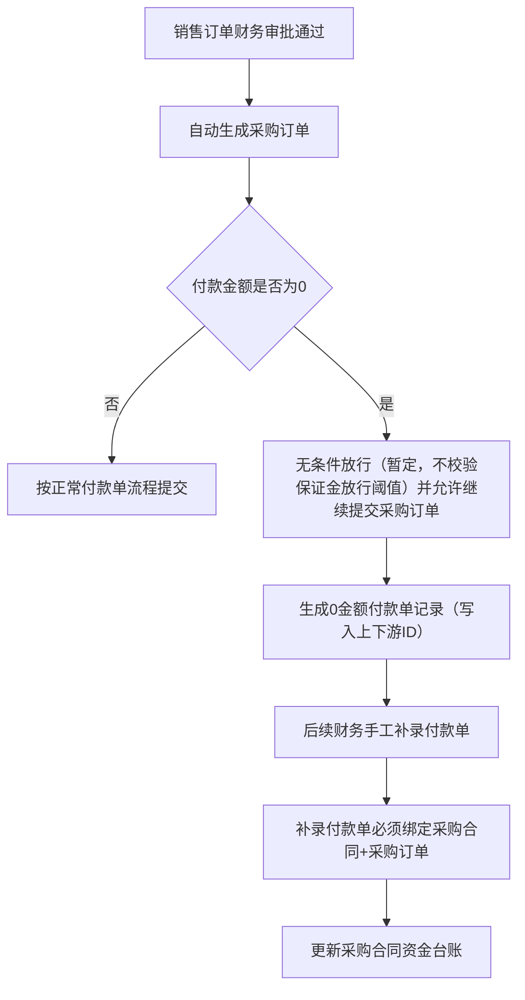

### 2.4 销售订单自动收款单（零金额/正常）流程
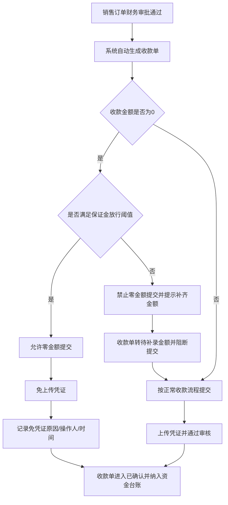

### 2.5 合同关闭与手工关闭流程
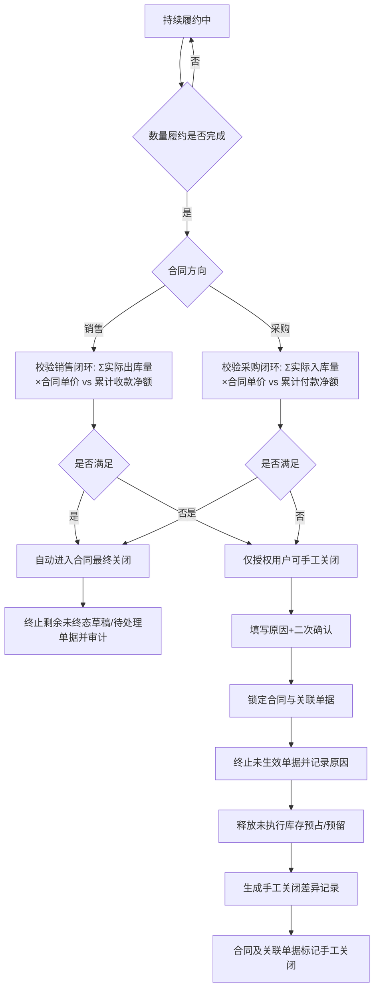

### 2.6 每日扫描与告警流程（闭环/履约）
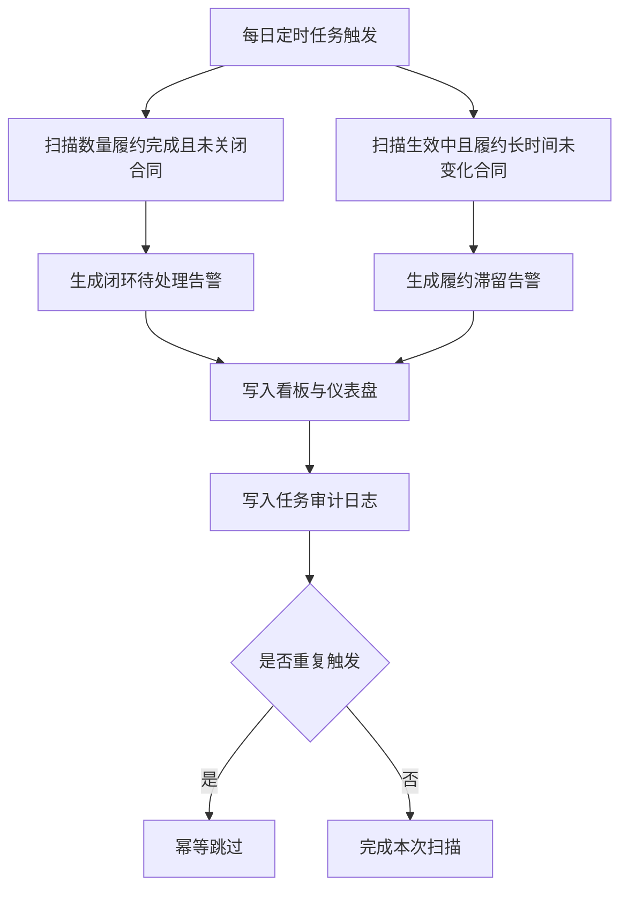

### 2.7 单据生成与上下游ID写入流程（强制）
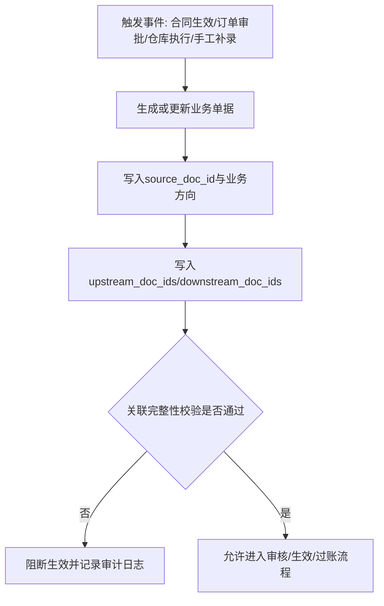

## 3. 核心状态机

### 3.1 合同状态机（采购/销售通用骨架）
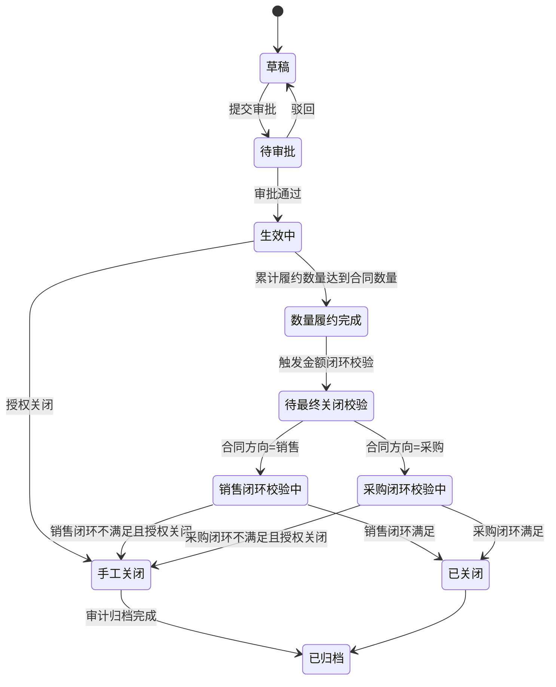

### 3.2 销售订单状态机
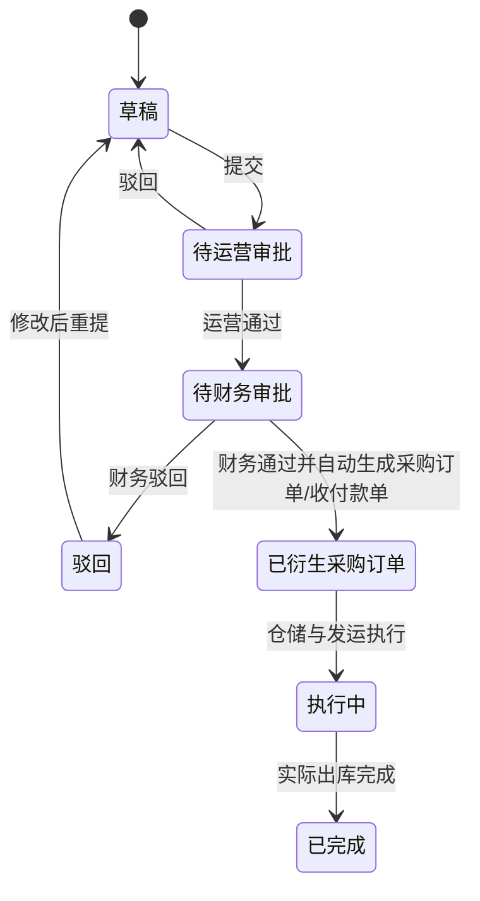

### 3.3 采购订单状态机（含零付款例外）
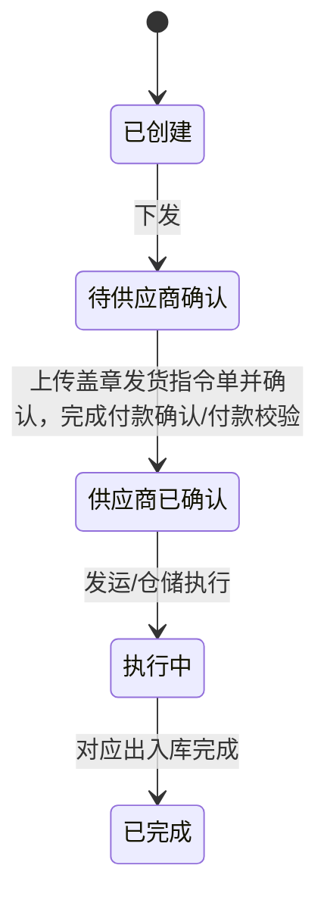

### 3.4 收付款单状态机
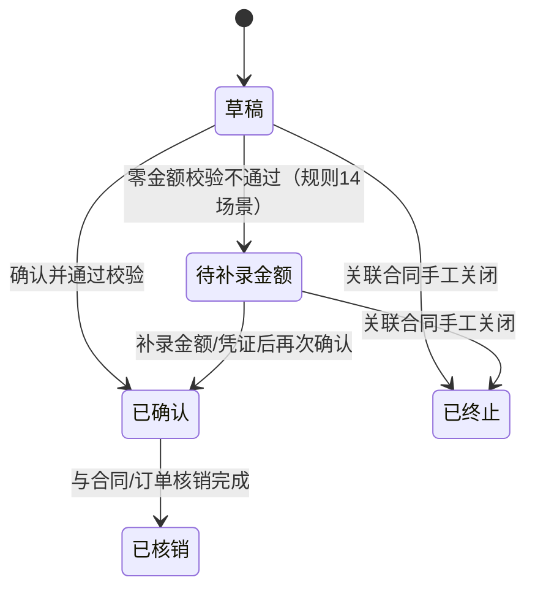

### 3.5 出入库单状态机
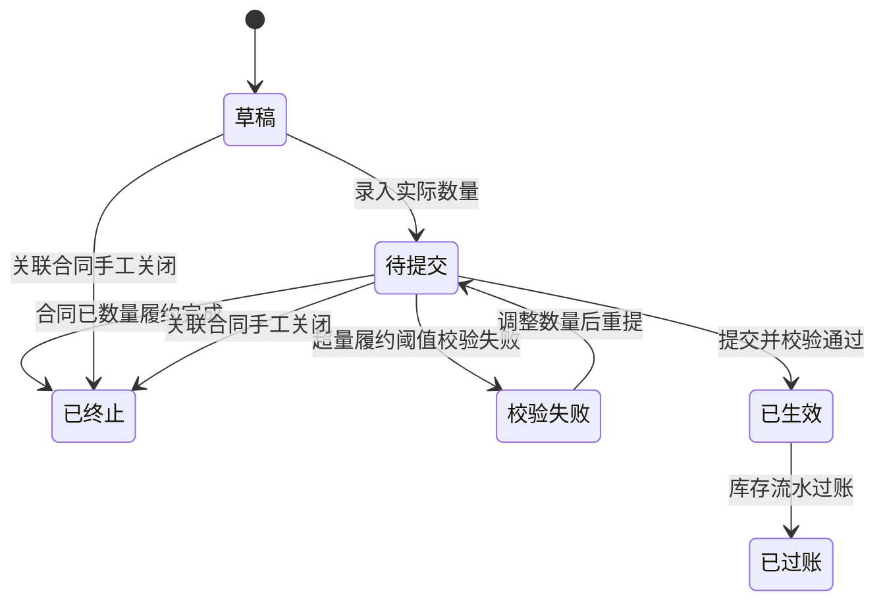

## 4. UI 原型清单

## 4.1 管理后台页面清单（全业务）

| 页面ID | 页面名称 | 角色 | 核心动作 | 关键校验/提示 | 关键状态 |
|---|---|---|---|---|---|
| ADM-DASH-01 | 经营仪表盘 | 管理层/财务/运营 | 查看核心KPI、异常预警跳转 | 指标口径版本展示、SLA时间戳展示；合同执行率仅统计已进入执行阶段合同；自然日口径固定为 `Asia/Shanghai` | 正常/延迟/口径变更 |
| ADM-BOARD-01 | 业务看板 | 运营/财务/管理员 | 查看待办、阻塞、超阈值任务并派单 | 超阈值红色告警、超时任务置顶 | 待处理/处理中/已解除 |
| ADM-CONTRACT-P-01 | 采购合同列表 | 财务/运营 | 新建、查询、审批流跟踪、关闭 | 超量履约阈值校验、关闭二次确认 | 草稿/待审批/生效中/数量履约完成/已关闭/手工关闭/已归档 |
| ADM-CONTRACT-S-01 | 销售合同列表 | 财务/运营 | 新建、审批、履约跟踪、关闭 | 金额闭环与数量闭环分开提示 | 同上 |
| ADM-CONTRACT-DETAIL-01 | 合同详情页 | 财务/运营/审计 | 查看上下游单据链路、手工关闭 | 手工关闭原因必填、审计快照 | 只读/可编辑/已关闭 |
| ADM-ORDER-S-01 | 销售订单列表 | 运营/财务/管理员 | 创建、审批、跟踪执行 | 单价来自合同且不可随意改写；实收实付以收付款单为准；附件按“合同/订单/凭证/采购订单”分层归属 | 草稿/待运营审批/待财务审批/驳回/已衍生采购订单/执行中/已完成 |
| ADM-ORDER-P-01 | 采购订单列表 | 运营/财务 | 由销售单衍生、下发供应商、回看供应商确认与后续仓库执行承接 | 付款确认/付款校验结果固化在`供应商已确认`节点；不拆独立付款校验交易状态 | 已创建/待供应商确认/供应商已确认/执行中/已完成 |
| ADM-PAYMENT-01 | 付款单列表 | 财务 | 自动生成/手工补录/确认 | 手工补录必须绑定采购合同+采购订单；0金额场景按规则11/14放行或转待补录金额 | 草稿/待补录金额/已确认/已核销/已终止 |
| ADM-RECEIPT-01 | 收款单列表 | 财务 | 自动生成/确认/凭证管理 | 0金额场景需阈值校验并记录免凭证原因；非0金额必须上传凭证 | 草稿/待补录金额/已确认/已核销/已终止 |
| ADM-INBOUND-01 | 入库单列表 | 运营/财务/管理员 | 录入实际入库数量并生效 | 未生效不计库存与履约 | 草稿/待提交/已生效/已过账 |
| ADM-OUTBOUND-01 | 出库单列表 | 运营/财务/管理员 | 系统生成/手工补录并生效 | 手工补录必须绑定销售合同 | 同上 |
| ADM-TRACE-01 | 单据链路追踪 | 审计/管理层 | 查看上下游图谱与明细 | 图谱中断告警、孤儿单据告警 | 正常/异常 |
| ADM-AUDIT-01 | 审计日志中心 | 审计/管理员 | 查询关键动作、导出留痕 | 关闭、终止、阈值越界重点标记 | 正常/告警 |
| ADM-ORG-01 | 组织与公司管理 | 管理员 | 维护运营商/客户/供应商/仓库公司档案、启停用与归属关系 | 不支持复杂集团化治理模型与多层法人穿透 | 启用/停用 |
| ADM-USER-01 | 用户与角色绑定 | 管理员 | 创建用户、分配角色、绑定公司、配置端登录权限 | 不支持权限审批工作流与外部 IAM 集成 | 待启用/启用/停用 |
| ADM-MASTER-01 | 主数据中心 | 管理员 | 维护客户、供应商、油品、仓库、库位、计量单位 | 不支持批量导入导出与高级治理规则编排 | 草稿/生效/停用 |
| ADM-APPROVAL-TPL-01 | 审批模板配置 | 管理员 | 维护合同/订单审批模板与版本 | 不支持通用 BPMN 引擎与跨组织动态编排 | 草稿/生效/停用 |
| ADM-CONFIG-01 | 参数与字典配置 | 管理员 | 阈值、编号规则、字典维护 | 参数变更需审批与版本号；保证金放行阈值<=合同超量履约阈值 | 草稿/生效/停用 |

## 4.2 小程序页面清单（移动轻量）

| 页面ID | 页面名称 | 角色 | 核心动作 | 不开放能力 | 关键状态 |
|---|---|---|---|---|---|
| MINI-TODO-01 | 我的待办 | 客户/运营/财务/供应商/仓库 | 查看并处理个人待办 | 不支持批量配置与批量关闭 | 待处理/已处理 |
| MINI-ORDER-01 | 销售订单发起与查询 | 客户/运营 | 发起订单、查看进度 | 不支持复杂改单与批量操作 | 草稿/待运营审批/待财务审批/驳回/已衍生采购订单/执行中/已完成 |
| MINI-EXEC-01 | 仓库执行回执 | 仓储 | 回传执行结果、上传现场附件 | 不支持主数据维护 | 待回执/已回执 |
| MINI-INOUT-01 | 简化出入库确认 | 仓储 | 快速确认出入库结果 | 不支持高级库存策略配置 | 待确认/已确认 |
| MINI-SUPPLIER-PO-01 | 供应商采购进度 | 供应商 | 查看采购订单进度、回看发货准备信息、上传并回看首批业务附件、提交发货确认、只读回看付款校验结果 | 不支持付款确认、异常关闭、批量处理 | 已创建/待供应商确认/供应商已确认/执行中/已完成 |
| MINI-REPORT-01 | 轻量报表 | 运营/财务/管理员（小程序） | 查看当日汇总与异常提醒 | 不支持多维钻取与重算；首版仅向运营/财务/管理员开放，不向客户/供应商/仓库暴露经营金额汇总 | 正常/延迟 |
| MINI-MSG-01 | 消息中心 | 全角色 | 查看告警、审批消息、超时提醒 | 不支持消息策略配置 | 未读/已读 |

## 5. 管理后台与小程序能力矩阵（冻结建议）

| 能力域 | 管理后台 | 小程序 | 决策说明 |
|---|---|---|---|
| 合同全生命周期 | 支持 | 仅查询 | 合同建立与关闭属于高风险操作 |
| 销售订单 | 支持全流程 | 支持发起/查询/轻审批 | 移动端保留高频动作 |
| 采购订单 | 支持全流程 | 查询进度 + 首批附件回传 + 单笔发货确认 | 小程序仅开放低风险协同动作，资金确认与异常处置仍保留后台 |
| 收付款单 | 支持全流程 | 仅查看结果 | 财务核销与凭证审核必须在后台 |
| 出入库单 | 支持全流程 | 支持执行回执与确认 | 执行动作可移动化，规则配置不可移动化 |
| 阈值与字典配置 | 支持 | 不支持 | 避免误操作造成全局风险 |
| 手工关闭 | 支持（授权） | 不支持 | 高风险动作需强审计场景 |
| 仪表盘与看板 | 支持 | 轻量摘要 | 管理决策在后台完成 |
| 多维报表 | 支持 | 不支持 | 多维分析与钻取对交互复杂度要求高 |

- 端登录边界冻结：客户、供应商、仓库角色仅允许小程序登录，不开放管理后台登录。

## 6. 原型产出清单（阶段A）
- 后台高保真原型：仪表盘、业务看板、合同详情链路页、收付款单页、出入库执行页。
- 小程序中保真原型：待办页、订单进度页、供应商采购进度页（含附件回传首批态）、执行回执页、轻量报表页。
- 原型状态覆盖：正常态、空态、异常态、审批态、超阈值告警态。

## 7. 评审通过标准（阶段A出口）
- 业务方确认：流程图覆盖采购、销售、资金、库存、关闭五大链路。
- 财务确认：收付款单据化、零付款例外、金额闭环口径一致。
- 财务确认：销售订单自动收款单“0金额/非0金额”两条分支流程完整且口径一致。
- 财务确认：采购/销售金额闭环分口径校验路径清晰，不存在混算。
- 仓储确认：入库生效前后口径一致，出库来源双通道（系统+手工）一致。
- 仓储确认：入库/出库生效前均执行合同超量履约阈值校验，超限阻断可见。
- 仓储确认：合同进入数量履约完成后，新增出入库生效被阻断。
- 财务确认：保证金在闭环净额中不重复计入，退款口径可追溯。
- 审计确认：双通道履约累计具备幂等防重，不出现重复累计。
- 管理确认：后台/小程序边界清晰，仪表盘与看板指标范围明确。
- 权限确认：角色与公司归属口径一致（客户/运营/财务/供应商/仓库+管理员），不存在跨公司越权。
- 审计确认：手工关闭、关键状态迁移、单据上下游ID写入均可追溯。
- UI确认：管理后台与小程序所有用户可见信息（系统提示、流程阻断、字段显示、状态描述）统一中文显示。

## 8. 冻结结果（阶段A）
- 本文新增的后台治理页面与状态口径属于阶段A冻结输入，用于约束后续设计与开发边界，不代表当前代码仓库已经具备对应页面实现。
- 采购订单零付款例外提示文案统一为：“例外放行（需后补付款单）”。
- 小程序审批边界冻结为：“仅允许查看驳回结果，不执行驳回动作与原因填写”。
- 管理后台仪表盘首版核心KPI冻结为：合同执行率、当日实收实付、库存周转、超阈值告警数。
- 首版KPI口径补充冻结为：合同执行率仅统计执行阶段合同；当日口径按 `Asia/Shanghai` 自然日；库存周转按近30个自然日计算。
- 管理后台与小程序用户可见文案冻结为中文显示，不允许英文提示直接面向终端用户。
